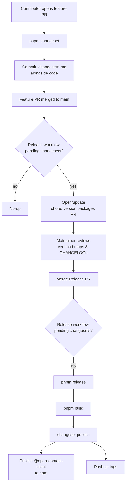
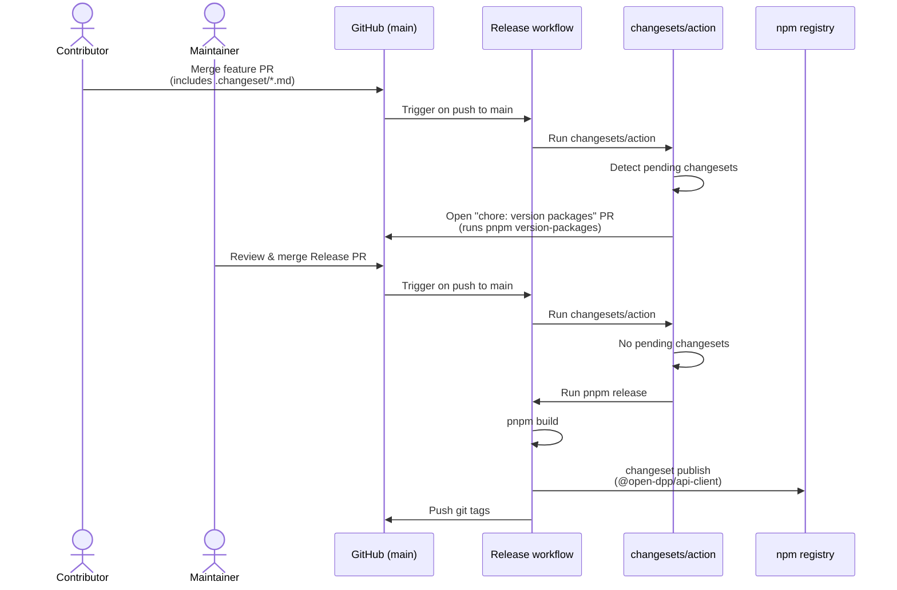

# Releasing

This document describes how releases are created in the `open-dpp` monorepo.

## Overview

Releases are managed with [Changesets](https://github.com/changesets/changesets). Every `@open-dpp/*` workspace package is version-locked via the `fixed` group in [`.changeset/config.json`](./.changeset/config.json), so all packages always share the same version number. Only [`@open-dpp/api-client`](./packages/api-client/package.json) is actually published to npm — every other workspace (apps and packages) is marked `private: true` and participates in the version bump only to keep internal `workspace:*` references consistent.

> **Publishing guardrail:** `.changeset/config.json` sets `"access": "restricted"` as the default for all packages. `@open-dpp/api-client` opts back in to public publishing via its own `publishConfig.access: "public"`. This means any _new_ scoped package added without an explicit `publishConfig` will fail to publish (on a free npm plan) instead of being silently published to the public registry — a safety net against accidentally shipping a package that forgot to set `"private": true`. If you add a new package that _should_ be public, set `publishConfig.access: "public"` in its `package.json` explicitly.

The flow is fully automated through [`.github/workflows/release.yml`](./.github/workflows/release.yml):

1. Contributors add a **changeset** file to any PR that changes code shipped in `@open-dpp/api-client`.
2. When such a PR is merged to `main`, the release workflow opens (or updates) a **"chore: version packages"** PR that bumps versions and updates changelogs.
3. When a maintainer merges that PR, the workflow publishes `@open-dpp/api-client` to npm and pushes git tags.



## When you need a changeset

Add a changeset if your PR changes code that is shipped in `@open-dpp/api-client`, either directly or through one of its dependencies (e.g. `@open-dpp/dto`).

You do **not** need a changeset for PRs that only touch:

- Documentation (`docs/`, `*.md`)
- CI / workflow configuration
- Tests that do not affect shipped code
- Backend-only (`apps/main`) or frontend-only (`apps/client`) changes that don't reach `@open-dpp/api-client` or its dependencies

If in doubt, add one — an unnecessary changeset only produces a no-op changelog entry.

## Adding a changeset to your PR (contributor flow)

From the repo root:

```bash
pnpm changeset
```

Then follow the interactive prompts:

1. **Select the bumped package(s).** In practice, select `@open-dpp/api-client`. Because of the `fixed` group, every other `@open-dpp/*` package will bump along with it automatically — you don't need to tick them manually.
2. **Pick the bump type** using semver:
   - `patch` — bug fixes and internal changes that don't affect the public API.
   - `minor` — backwards-compatible new features or additions to the public API.
   - `major` — breaking changes to the public API.
3. **Write a summary.** This becomes the `CHANGELOG.md` entry end users will read, so write it for them — describe _what changed_ and _why it matters_, not the implementation details.

Changesets will generate a file at `.changeset/<random-name>.md`. **Commit it with your code changes.** Because `commit: false` is set in `.changeset/config.json`, Changesets does not commit the file for you.

Example changeset file:

```markdown
---
"@open-dpp/api-client": minor
---

Add `listProducts` endpoint for fetching a paginated list of products.
```

## What happens on merge to `main` (automated flow)

The [`Release`](./.github/workflows/release.yml) workflow runs on every push to `main` and uses [`changesets/action`](https://github.com/changesets/action) to decide what to do:

- **If there are pending `.changeset/*.md` files:** the workflow opens (or updates) a PR titled **"chore: version packages"**. That PR runs `pnpm version-packages` (i.e. `changeset version`), which:
  - Consumes the pending changeset files and deletes them.
  - Bumps every `@open-dpp/*` package to the next version in lock-step.
  - Regenerates `CHANGELOG.md` for each package using the `@changesets/changelog-github` formatter, which links back to the PRs and contributors.
- **If there are no pending changesets:** the workflow is a no-op.



## Cutting a release (maintainer flow)

1. Open the **"chore: version packages"** PR in GitHub.
2. Review:
   - The version bumps are what you expect (check that the `fixed` group bumped everything consistently).
   - The generated `CHANGELOG.md` entries read well for end users.
3. Merge the PR into `main`.
4. On that merge, the release workflow runs again. This time it detects that there are no pending changesets and executes `pnpm release`, which runs:
   ```bash
   pnpm build && changeset publish
   ```
   `changeset publish` pushes git tags for the new version and publishes `@open-dpp/api-client` to npm under `--access public`. All private packages are skipped automatically.
5. Verify the release:
   - A new tag appears on [GitHub](https://github.com/open-dpp/open-dpp/tags).
   - The new version appears on [npmjs.com/package/@open-dpp/api-client](https://www.npmjs.com/package/@open-dpp/api-client).

## Required repository secrets

Both secrets are configured on the `open-dpp/open-dpp` repository:

| Secret         | Purpose                                                                                                                    |
| -------------- | -------------------------------------------------------------------------------------------------------------------------- |
| `NPM_TOKEN`    | npm automation token with publish rights to the `@open-dpp` scope. Consumed by `pnpm release` / `changeset publish`.       |
| `GITHUB_TOKEN` | Provided automatically by Actions. Requires `contents: write` and `pull-requests: write`, already set in `release.yml`.    |

If `NPM_TOKEN` is missing or expired, the `Release` job will fail at the publish step. Rotate the token in npm, update the GitHub secret, and re-run the failed job.

## Manual / local release (escape hatch)

The automated flow above is the only supported path. Only fall back to a manual release if the GitHub workflow is broken:

```bash
pnpm changeset            # create a changeset if you don't already have one
pnpm version-packages     # consume changesets, bump versions, update CHANGELOGs
git commit -am "chore: version packages"
git push
pnpm release              # runs: pnpm build && changeset publish (requires NPM_TOKEN in env)
git push --follow-tags
```

## Troubleshooting

- **"No changesets found" in a Release PR** — a changeset was not added to the merged PR. Create one with `pnpm changeset` in a follow-up PR.
- **Release PR has no version bumps** — the changesets targeted only private packages. Target `@open-dpp/api-client` (or any member of the `fixed` group) so the bump actually happens.
- **`changeset publish` skipped a package** — expected. Everything other than `@open-dpp/api-client` is `private: true` and intentionally not published.
- **npm publish failed with 401 / 403** — `NPM_TOKEN` is missing, expired, or lacks publish rights to the `@open-dpp` scope. Rotate it and re-run the job.
- **A version bump is wrong after the Release PR is created** — close the Release PR, add a new changeset with the correct bump type, and push to `main`. The workflow will recreate the PR with the updated versions.
