# GS1 UPI + Polymorphic Permalink — TDD Implementation Plan

A single, globally dependency-ordered, test-driven implementation plan for the GS1 UPI +
polymorphic Permalink full-stack remodel.

## 1. Overview

This plan turns two architectural decisions into a sequenced, TDD-disciplined implementation
across the shared packages, the NestJS backend, the typed API client, the Fishery test
factories, and the Vue frontend.

**Authoritative sources (read all three before implementing any slice):**

- [`CONTEXT.md`](../../CONTEXT.md) — the project glossary (UPI, GS1 UPI, GS1 Identity, Permalink,
  Presentation Permalink, GS1 Digital Link Permalink, Primary Permalink, GS1 Digital Link, GS1
  Data Attributes, Key Qualifiers).
- [`docs/adr/0001-polymorphic-permalink.md`](../adr/0001-polymorphic-permalink.md) — Permalink
  becomes a polymorphic resolver (presentation **or** GS1 Digital Link); `presentationConfigurationId`
  nullable; resolution uses the passport's **primary** permalink; guarded delete.
- [`docs/adr/0002-first-class-many-per-passport-gs1-upis.md`](../adr/0002-first-class-many-per-passport-gs1-upis.md)
  — GS1 UPIs are first-class, many-per-passport, own their identity, reference a passport; the 1:1
  `PUT/DELETE /passports/:id/gs1-identity` write surface is replaced by a UPI-collection API; each
  GS1 key stays globally unique; create/edit/delete only while the passport is a draft.

### Authoritative resolved decisions

1. **UPI is first-class and owns its GS1 identity.** A passport may have **many** GS1 UPIs (one per
   batch/serial). Each GS1 key `(gtin, batch, serial)` is globally unique (enforced by the existing
   partial unique DB index). The 1:1 GS1-identity write surface is superseded by a UPI-collection
   API.
2. **UPI lifecycle freeze.** Create/edit/delete a GS1 UPI is allowed **only while the referenced
   passport is a draft**; locked once published. This is a use-case/controller concern (the UPI
   domain holds only `referenceId`, no passport handle), mirroring today's `loadDraftPassportForWrite`.
3. **Permalink is polymorphic.** A permalink is either a **presentation** permalink (references a
   presentation configuration) or a **gs1-link** permalink (references a UPI; at most one such
   permalink per UPI; may _also_ reference a presentation configuration; carries a nullable GS1
   data-attributes map + its own nullable GS1 resolver base). `presentationConfigurationId` is
   nullable.
4. **Primary presentation permalink.** A passport may have several presentation permalinks; exactly
   one is **primary** (the canonical public URL). Public resolution uses the primary instead of
   `permalink[0]`.
5. **Guarded delete.** Cannot delete a published permalink (`publishedUrl` set = frozen) nor the
   last/primary presentation permalink. GS1-link permalinks delete freely when unpublished.
6. **GS1 Digital Link assembly.** `gs1ResolverBase` + UPI key-path (`/01/{gtin}/10/{batch}/21/{serial}`)
   - the permalink's GS1 data-attribute query (`?17=251231&3103=000189`). Scan resolution:
     key → UPI → its GS1-link permalink → render its own presentation config if set, else fall back
     to the passport's primary permalink.
7. **GS1 data attributes** are a map keyed by AI string; each key must be a known **non-key**
   (data-attribute) GS1 AI and each value validated against that AI's format/length. Implemented
   from a **battle-tested GS1 AI source vendored into `packages/dto`** (the GS1 DigitalLinkToolkit
   `aitable`), preserving the package's zero-runtime-dependency, DOM-safe, fully-typed properties.
8. **Per-permalink `gs1ResolverBase` overrides the cascade** (org branding → instance setting →
   `OPEN_DPP_URL`) when set, else falls back — mirroring how `baseUrl` works for presentation.
9. **Frontend.** Two org-scoped lists: a **UPI list** (shows all UPIs; system `OPEN_DPP_UUID` rows
   read-only; GTIN/EAN shown if present, not creatable; create GS1 only, then prompt "add a GS1
   Digital Link?") and a **Permalink list** (shows all permalinks; full CRUD; create a GS1 link by
   picking a UPI; presentation permalinks gain primary + guarded delete). The three DPP-toolbar
   dialogs (`Gs1SettingsDialog`, `PermalinkSettingsDialog`, `Gs1QrCodeDialog`) are replaced by
   deep-links into the two new filtered lists; the QR renders from a GS1 Digital Link permalink.
10. **Migration.** Backfill `primary` on existing permalinks (+ null GS1 fields) via migrate-on-read;
    existing GS1 UPIs stay link-less and rely on fallback resolution.

### TDD discipline (every slice)

Write the failing test FIRST (RED), run it to confirm it fails, then write the minimal
implementation (GREEN), then refactor. Match existing patterns:

- **`packages/dto`, `packages/api-client`, `packages/testing`** — Jest.
  `cd packages/<pkg> && pnpm exec jest <relative-spec-path>`
- **`apps/main`** (backend) — Jest + `MongoMemoryReplSet` (shared via Jest global setup; never open
  your own Mongo connection). `cd apps/main && NODE_OPTIONS=--experimental-vm-modules pnpm exec jest <file>`
- **`apps/client`** (frontend) — Vitest. `cd apps/client && pnpm exec vitest run src/path/to/file.spec.ts`
  - vee-validate caveat: never `form.trigger("submit")` under jsdom — click the (stubbed) submit
    Button or call the handler directly.

### Conventions carried into this plan

- **`zod` import style:** files in `packages/dto` import from `"zod"` (^4); the backend domain entity
  imports `"zod/v4"`. Keep imports consistent per layer (no version conflict — installed zod is v4).
- **Single source of truth for shared types:** the shared collection/polymorphic DTOs live in
  `@open-dpp/dto`; `apps/main` re-exports them rather than redefining. `ExternalIdentifierType` moves
  to `@open-dpp/dto` with `apps/main` re-exporting (resolves the duplication flagged across areas).
- **Permalink field naming (canonical for the whole plan):** `uniqueProductIdentifierId` (the UPI
  reference), `primary`, `gs1ResolverBase`, `gs1DataAttributes`. The draft factory area suggested
  `uniqueProductIdentifierId`; the migration area used `upiId` as a placeholder — **this plan
  standardises on `uniqueProductIdentifierId`** everywhere (Doc, DTO, domain, factories).
- **Org-scoping (cross-area decision, settled here):** `organizationId` is **denormalized onto both
  `UniqueProductIdentifierDoc` and `PermalinkDoc`**, populated at save time from the owning
  passport's `organizationId`. This is required because a gs1-link permalink has a null
  `presentationConfigurationId` (the config→org join yields null) and a UPI has no org field at all.
  Both collections get a compound index `{ organizationId, createdAt: -1, _id: -1 }`. The Permalink
  domain already satisfies `IPersistable + HasCreatedAt + IConvertableToPlain`, so it can reuse the
  generic `findAllByOrganizationId`; the UPI domain (uuid≠id, no `createdAt`) uses a **custom
  cursor-paginated query** built from the doc's `createdAt + _id`.

---

## 2. Globally dependency-ordered TDD slices

Slices are renumbered 1..N in dependency order. Backend/shared packages come before frontend.
Cross-area overlaps are **deduplicated** into a single slice (e.g. the GS1 data-attributes schema,
the polymorphic Permalink DTO, the org-scoping decision). Each slice lists its dependencies by slice
number.

> Legend for layers: **dto** = `packages/dto`, **domain** = `apps/main/.../domain`,
> **infra** = `apps/main/.../infrastructure`, **service** = `apps/main/.../application`,
> **controller/openapi** = `apps/main/.../presentation` + `apps/main/src/open-api-docs`,
> **api-client** = `packages/api-client`, **testing** = `packages/testing`, **fe-\*** = `apps/client`.

---

### PART A — Shared GS1 data-attributes foundation (`packages/dto`)

#### Slice 1 — Vendor the GS1 AI table as a typed, attributed constant

- **Layer:** dto
- **Files:** `packages/dto/src/gs1/gs1-ai-table.generated.ts` (new),
  `packages/dto/src/gs1/gs1-ai-table.generated.spec.ts` (new)
- **Failing test(s) first:** `gs1-ai-table.generated.spec.ts` — import `GS1_AI_TABLE` +
  `Gs1AiTableEntry`. Assert: (1) `GS1_AI_TABLE` is a non-empty `Record` keyed by AI string;
  (2) entry `"17"` has `type:'D'`, `fixedLength:true`, a 6-digit regex, title containing
  "Expiration"; entry `"3103"` has `type:'D'`, `fixedLength:true`, 6-digit regex; (3) `"01"` →
  `type:'I'`, `"10"` → `type:'Q'`, `"21"` → `type:'Q'`; (4) every entry exposes string
  `ai`/`format`/`regex`, a `type` in `['I','Q','D']`, and boolean `fixedLength`; (5) a count guard
  of at least ~400 `type:'D'` entries; (6) the file text contains an Apache-2.0 + `GS1DigitalLinkToolkit`
  provenance header (read via `fs`).
- **Implementation:** Vendor the GS1 DigitalLinkToolkit.js `aitable` (476 AIs), reshaped from array
  to a `Record` keyed by `ai`. Define `Gs1AiTableEntry { ai; title; format; type:'I'|'Q'|'D';
fixedLength; regex; shortcode?; checkDigit?; qualifiers? }`. Header: provenance URL + pinned commit
  SHA, "DO NOT EDIT BY HAND", Apache-2.0 notice. Pure data + types, no I/O. **Zero** new runtime deps.
- **Acceptance:** spec GREEN; no dependency added to `packages/dto/package.json`.
- **Depends on:** —

#### Slice 2 — `isGs1DataAttributeAi` predicate (non-key classification)

- **Layer:** dto
- **Files:** `packages/dto/src/gs1/gs1-digital-link.ts`, `packages/dto/src/gs1/gs1-digital-link.spec.ts`
- **Failing test(s) first:** add `describe('isGs1DataAttributeAi')` — true for `"17"`, `"3103"`,
  `"11"`; false for key/identifier AIs `"01"`, `"10"`, `"21"`; false for unknown `"9999"`; false for
  junk `"abc"`, `""`, `" 17"`; does not mutate input.
- **Implementation:** `export const isGs1DataAttributeAi = (ai: string): boolean =>
GS1_AI_TABLE[ai]?.type === 'D'`. <10 lines, pure.
- **Acceptance:** spec GREEN.
- **Depends on:** 1

#### Slice 3 — `isValidGs1DataAttributeValue` (per-AI value format/length)

- **Layer:** dto
- **Files:** `packages/dto/src/gs1/gs1-digital-link.ts`, `packages/dto/src/gs1/gs1-digital-link.spec.ts`
- **Failing test(s) first:** add `describe('isValidGs1DataAttributeValue')` — `"17"` accepts `"251231"`,
  rejects `"25123"`/`"2512311"`/`"2512AB"`; `"3103"` accepts `"000189"`, rejects `"18"`/`"abcdef"`; a
  variable-length CSET-82 `type:'D'` AI (e.g. `"240"`, X..30) accepts an in-range string and rejects
  an over-length / out-of-charset one; returns false for an unknown AI and for a key qualifier
  (`"21"`); returns false for empty value.
- **Implementation:** look up `GS1_AI_TABLE[ai]`; bail `false` if absent or `type!=='D'`. Compile an
  anchored `RegExp('^(?:' + entry.regex + ')$')`, memoised in a module `Map<string,RegExp>`. Add an
  explicit `value.length >= 1` guard. Pure.
- **Acceptance:** spec GREEN.
- **Depends on:** 2

#### Slice 4 — `Gs1DataAttributesSchema` (Zod map keyed by validated AI → validated value)

- **Layer:** dto
- **Files:** `packages/dto/src/gs1/gs1-data-attributes.dto.ts` (new),
  `packages/dto/src/gs1/gs1-data-attributes.dto.spec.ts` (new)
- **Failing test(s) first:** `gs1-data-attributes.dto.spec.ts` — `Gs1DataAttributesSchema` parses
  `{"17":"251231","3103":"000189"}` and preserves the map; rejects an unknown AI key `{"99zz":"x"}`/
  `{"9999":"x"}`; rejects a KEY AI key `{"01":...}`, `{"10":...}`, `{"21":...}`; rejects a bad value
  `{"17":"2512"}` (short) and `{"17":"abcdef"}` (non-numeric) and `{"3103":"abc"}`; accepts empty
  `{}`; rejects a non-object/array; the Zod issue `path` points at the offending AI key (assert
  `path` includes `"17"` for the bad-value case); does not mutate input; importable in a pure module
  (no DOM/Node-only globals at import time).
- **Implementation:** `Gs1DataAttributesSchema = z.record(z.string(), z.string()).check(ctx => { for
each [ai,value]: !isGs1DataAttributeAi(ai) → issue path [ai] "\"${ai}\" is not a known GS1
data-attribute AI"; else !isValidGs1DataAttributeValue(ai,value) → issue path [ai] "value for AI
\"${ai}\" is invalid" }).meta({ id: 'Gs1DataAttributes' })`. Export `type Gs1DataAttributes`. Reuse
  the key-AI constants `GS1_AI_GTIN/BATCH/SERIAL` indirectly through `isGs1DataAttributeAi`.
- **Acceptance:** spec GREEN.
- **Depends on:** 3

#### Slice 5 — `buildGs1DataAttributeQuery` (canonical, validated query string)

- **Layer:** dto
- **Files:** `packages/dto/src/gs1/gs1-digital-link.ts`, `packages/dto/src/gs1/gs1-digital-link.spec.ts`
- **Failing test(s) first:** add `describe('buildGs1DataAttributeQuery')` — empty/undefined/null →
  `''`; `{"17":"251231"}` → `'?17=251231'`; `{"17":"251231","3103":"000189"}` → `'?17=251231&3103=000189'`
  in deterministic ascending-AI order (assert reverse-insertion-order input yields the same string);
  values percent-encoded via the existing `encodeComponent` (e.g. a `/` in an X..n value → `%2F`);
  throws on an unknown AI key and on an invalid value.
- **Implementation:** iterate sorted `Object.keys(attributes)`; for each throw if
  `!isGs1DataAttributeAi(ai)` or `!isValidGs1DataAttributeValue(ai,value)`; build
  `${ai}=${encodeComponent(value)}`; join `'&'`; prefix `'?'` only when non-empty. No mutation. <30 lines.
- **Acceptance:** spec GREEN.
- **Depends on:** 3

#### Slice 6 — Thread data attributes into `buildGs1DigitalLink` (path + query)

- **Layer:** dto
- **Files:** `packages/dto/src/gs1/gs1-digital-link.ts`, `packages/dto/src/gs1/gs1-digital-link.spec.ts`
- **Failing test(s) first:** extend `describe('buildGs1DigitalLink')` — with no `dataAttributes` output
  is byte-identical to today (regression); `{gtin,batch,serial,dataAttributes:{"17":"251231"}}` →
  `<base>/01/<gtin14>/10/<lot>/21/<serial>?17=251231`; multiple attributes → canonical sorted query;
  empty `{}`/null → no query; an unknown-AI/invalid-value attribute makes `buildGs1DigitalLink` throw;
  query is always appended after the serial segment.
- **Implementation:** add optional `dataAttributes?: Record<string,string> | null` to
  `Gs1DigitalLinkParts`; at the end of `buildGs1DigitalLink` do `url +=
buildGs1DataAttributeQuery(parts.dataAttributes)`. Leave the existing GTIN/batch/serial logic and
  `formatGs1ElementString` untouched.
- **Acceptance:** spec GREEN; all pre-existing `buildGs1DigitalLink` tests still pass.
- **Depends on:** 5

#### Slice 7 — Barrel-export the GS1 data-attributes schema + helpers

- **Layer:** dto
- **Files:** `packages/dto/src/index.ts`, `packages/dto/src/gs1/gs1-data-attributes.barrel.spec.ts` (new)
- **Failing test(s) first:** `gs1-data-attributes.barrel.spec.ts` — import from the package root and
  assert `Gs1DataAttributesSchema` (object), `isGs1DataAttributeAi`/`isValidGs1DataAttributeValue`/
  `buildGs1DataAttributeQuery` (functions), and `type Gs1DataAttributes` resolve.
- **Implementation:** add `export * from "./gs1/gs1-data-attributes.dto";` next to the existing
  `./gs1/gs1-digital-link` export (which already re-exports the new helpers).
- **Acceptance:** spec GREEN; `cd packages/dto && pnpm exec jest && pnpm exec tsc --noEmit` clean.
- **Depends on:** 4, 6

---

### PART B — UPI & Permalink shared DTOs (`packages/dto`)

#### Slice 8 — Move `ExternalIdentifierType` to `@open-dpp/dto` + add `Gs1GranularitySchema`

- **Layer:** dto
- **Files:** `packages/dto/src/gs1/external-identifier-type.ts` (new) or
  `packages/dto/src/unique-product-identifier/...`, `packages/dto/src/index.ts`,
  `packages/dto/src/gs1/external-identifier-type.spec.ts` (new)
- **Failing test(s) first:** assert `ExternalIdentifierType` const-object has
  `OPEN_DPP_UUID/GS1/GTIN/EAN`; `ExternalIdentifierTypeSchema` is a `z.enum` accepting those and
  rejecting unknown; `Gs1GranularitySchema` is a `z.enum(['model','batch','item'])`.
- **Implementation:** define the const + schema + granularity enum in the shared package; export from
  `index.ts`. (`apps/main` re-export happens in Slice 23 to keep existing imports working.)
- **Acceptance:** spec GREEN.
- **Depends on:** —

#### Slice 9 — `UniqueProductIdentifierListItemDtoSchema` + list schema (read shape)

- **Layer:** dto
- **Files:** `packages/dto/src/unique-product-identifier/unique-product-identifier-list-item.dto.ts`
  (new), `.../unique-product-identifier-list-item.dto.spec.ts` (new), `packages/dto/src/index.ts`
- **Failing test(s) first:** parses a GS1 row `{uuid, referenceId, type:'GS1', gtin:<GTIN-14>, batch?,
serial?, granularity:'batch', digitalLink:(url|null), passportPublished:boolean}`; a system row
  `{type:'OPEN_DPP_UUID', gtin:null, batch:null, serial:null, granularity:null}`; a GTIN/EAN row
  (`type:'GTIN'`, gtin present, granularity `'model'`, no `digitalLink` required); rejects a GS1 row
  with a non-normalized 13-digit gtin (must be GTIN-14 via `Gtin14Schema`); rejects an unknown type;
  list schema parses an array and `.element` equals the item schema. **No GS1 data attributes appear
  on this schema.**
- **Implementation:** reuse `Gtin14Schema`/`Cset82ComponentSchema`/`ExternalIdentifierTypeSchema`/
  `Gs1GranularitySchema`. `digitalLink: z.string().url().nullish()`, `passportPublished: z.boolean()`.
  `.meta({ id: 'UniqueProductIdentifierListItem' })`. Export both schemas + inferred types.
- **Acceptance:** spec GREEN.
- **Depends on:** 8

#### Slice 10 — `CreateGs1UniqueProductIdentifierRequestSchema` (create DTO)

- **Layer:** dto
- **Files:** `packages/dto/src/unique-product-identifier/create-unique-product-identifier.dto.ts` (new),
  `.../create-unique-product-identifier.dto.spec.ts` (new), `packages/dto/src/index.ts`
- **Failing test(s) first:** accepts `{referenceId:<uuid>, gtin:'4006381333931', batch?, serial?}` and
  transforms gtin to GTIN-14 `'04006381333931'`, coerces blank batch/serial to undefined, trims;
  rejects a missing `referenceId`; rejects an invalid GTIN check digit; rejects a batch outside
  CSET-82 / over-length serial; **no `type` field, no data attributes**.
- **Implementation:** `z.object({ referenceId: z.uuid(), gtin: GtinInputSchema, batch:
Cset82ComponentInputSchema.optional(), serial: Cset82ComponentInputSchema.optional() })
.meta({ id: 'CreateGs1UniqueProductIdentifierRequest' })`. GS1-only by construction (no type field).
  Export inferred type.
- **Acceptance:** spec GREEN.
- **Depends on:** 9

#### Slice 11 — `UpdateGs1UniqueProductIdentifierRequestSchema` (update DTO)

- **Layer:** dto
- **Files:** `packages/dto/src/unique-product-identifier/update-unique-product-identifier.dto.ts` (new),
  `.../update-unique-product-identifier.dto.spec.ts` (new), `packages/dto/src/index.ts`
- **Failing test(s) first:** accepts `{gtin:'4006381333931', batch?, serial?}` (no `referenceId` —
  reference immutable), normalizes gtin, coerces blank batch/serial to undefined (clear semantics),
  trims; rejects an invalid GTIN; **no `type`, no data attributes**; omitting batch/serial means
  "clear that qualifier" (replace-not-merge, matching domain `withGs1`).
- **Implementation:** identical to Slice 10 minus `referenceId`. Keep it a distinct named schema (the
  API surface stays explicit). Export inferred type.
- **Acceptance:** spec GREEN.
- **Depends on:** 10

#### Slice 12 — `PermalinkKind` discriminator + nullable `presentationConfigurationId` in `PermalinkDtoSchema`

- **Layer:** dto
- **Files:** `packages/dto/src/permalinks/permalink.dto.ts`, `packages/dto/src/permalinks/permalink.dto.spec.ts`
- **Failing test(s) first:** new `describe('PermalinkDtoSchema polymorphism')` — (1) parses a
  presentation permalink `{kind:'presentation', presentationConfigurationId:<uuid>,
uniqueProductIdentifierId:null, primary:true, gs1ResolverBase:null, gs1DataAttributes:null,
…timestamps}`; (2) parses a gs1-link permalink `{kind:'gs1-link', presentationConfigurationId:null,
uniqueProductIdentifierId:<uuid>, primary:false, gs1ResolverBase:'https://id.acme.com',
gs1DataAttributes:{'17':'251231'}}`; (3) accepts `presentationConfigurationId:null`; (4) rejects an
  unknown `kind`; (5) rejects a gs1-link with `uniqueProductIdentifierId:null`; (6) rejects a
  presentation permalink with non-null `uniqueProductIdentifierId` OR `gs1ResolverBase` OR
  `gs1DataAttributes`; (7) parses a legacy doc lacking `kind/primary/uniqueProductIdentifierId/gs1*`
  → defaults `kind:'presentation'`, `primary:false`, the rest `null`.
- **Implementation:** add `PermalinkKind = {PRESENTATION:'presentation', GS1_LINK:'gs1-link'} as const`
  - `PermalinkKindSchema`. Rework `PermalinkDtoSchema` base fields `{id, kind (default
'presentation'), slug, baseUrl, publishedUrl, presentationConfigurationId: z.uuid().nullable(),
uniqueProductIdentifierId: z.uuid().nullable().default(null), primary: z.boolean().default(false),
gs1ResolverBase: PermalinkBaseUrlSchema.nullable().default(null), gs1DataAttributes:
Gs1DataAttributesSchema.nullable().default(null), createdAt, updatedAt}`.
- **⚠️ REQUIRED shape — keep `PermalinkDtoSchema` a `ZodObject`; enforce the cross-field invariants with
  `.check()`/`.superRefine`, NOT `z.discriminatedUnion`.** `PermalinkDtoSchema` must remain a single
  `ZodObject` because (1) `PermalinkPublicDtoSchema = PermalinkDtoSchema.extend({…})` and
  `PermalinkListDtoSchema = z.array(PermalinkPublicDtoSchema)` rely on `.extend()`, which exists ONLY on
  `ZodObject` (a discriminated union has no `.extend`), and (2) the Permalink domain consumes it via
  `PermalinkDtoSchema.parse(data)` in `fromPlain` (permalink.ts:66). A discriminated union would break
  both call sites and change the inferred type shape. So: define the object with all fields nullable/
  defaulted, then attach a `.check(ctx => …)` (or `.superRefine`) that rejects (a) unknown `kind`,
  (b) a `gs1-link` with null `uniqueProductIdentifierId`, and (c) a `presentation` permalink carrying a
  non-null `uniqueProductIdentifierId` / `gs1ResolverBase` / `gs1DataAttributes`. Keep
  `.meta({ id: 'Permalink' })`. `PermalinkPublicDtoSchema` continues to `.extend` this (its existing spec
  uses a non-null configId so it stays green). Reserve `z.discriminatedUnion('kind', …)` for the REQUEST
  schemas only (Slices 13/14), where nothing calls `.extend()` on them.
- **Acceptance:** spec GREEN; `PermalinkDtoSchema` is still a `ZodObject` (its `.extend`/`PermalinkPublicDtoSchema`
  and the domain's `PermalinkDtoSchema.parse` keep working unchanged).
- **Depends on:** 4

#### Slice 13 — `PermalinkInvariantsSchema` (create-time) made polymorphic

- **Layer:** dto
- **Files:** `packages/dto/src/permalinks/permalink.dto.ts`, `packages/dto/src/permalinks/permalink.dto.spec.ts`
- **Failing test(s) first:** new `describe('PermalinkInvariantsSchema')` — (1) accepts presentation
  create `{kind:'presentation', presentationConfigurationId:<uuid>, slug:null}`; (2) accepts gs1-link
  `{kind:'gs1-link', uniqueProductIdentifierId:<uuid>, presentationConfigurationId:null,
gs1ResolverBase:null, gs1DataAttributes:null}`; (3) accepts a gs1-link that also sets
  `presentationConfigurationId:<uuid>`; (4) rejects a gs1-link without `uniqueProductIdentifierId`;
  (5) rejects a presentation create with `uniqueProductIdentifierId` set; (6) **presentation kind
  REQUIRES a non-null `presentationConfigurationId`**.
- **Implementation:** rework `PermalinkInvariantsSchema` into a discriminated union over `kind`:
  presentation ⇒ `presentationConfigurationId: z.uuid()` (non-null), UPI + gs1 fields forbidden;
  gs1-link ⇒ `uniqueProductIdentifierId: z.uuid()` required, `presentationConfigurationId:
z.uuid().nullable()`, `gs1ResolverBase: PermalinkBaseUrlSchema.nullable().optional()`,
  `gs1DataAttributes: Gs1DataAttributesSchema.nullable().optional()`; `slug:
PermalinkSlugSchema.nullable()`, `baseUrl: PermalinkBaseUrlSchema.nullable().optional()` in both.
- **A discriminated union IS safe here** (unlike `PermalinkDtoSchema` in Slice 12): nothing calls
  `.extend()` on `PermalinkInvariantsSchema`, and its only consumer is the domain `create()` which does a
  single `PermalinkInvariantsSchema.parse({ kind, presentationConfigurationId, uniqueProductIdentifierId,
gs1ResolverBase, gs1DataAttributes, slug, baseUrl })` (one call, not field-wise — verified at
  permalink.ts:36). When Slice 17 reworks `create()`, it must build the discriminator object with `kind`
  defaulting to `'presentation'` BEFORE calling `.parse()` so the union resolves the correct variant.
- **Acceptance:** spec GREEN.
- **Depends on:** 12

#### Slice 14 — `PermalinkCreateRequestSchema` + extended `PermalinkUpdateRequestSchema`

- **Layer:** dto
- **Files:** `packages/dto/src/permalinks/permalink.dto.ts`, `packages/dto/src/permalinks/permalink.dto.spec.ts`
- **Failing test(s) first:** `describe('PermalinkCreateRequestSchema')` — (1) parses presentation
  `{kind:'presentation', presentationConfigurationId:<uuid>, slug?, baseUrl?}`; (2) parses gs1-link
  `{kind:'gs1-link', uniqueProductIdentifierId:<uuid>, presentationConfigurationId?:<uuid>|null,
gs1ResolverBase?, gs1DataAttributes?, slug?}`; (3) rejects gs1-link without
  `uniqueProductIdentifierId`; (4) rejects presentation with `gs1ResolverBase`/`gs1DataAttributes`.
  `describe('PermalinkUpdateRequestSchema')` — (5) still accepts `{slug, baseUrl}`; (6) accepts
  `{primary:true}`; (7) accepts `{gs1ResolverBase, gs1DataAttributes}`; (8) accepts
  `{presentationConfigurationId:<uuid>|null}`; (9) does NOT accept changing `kind` (absent/stripped).
- **Implementation:** `PermalinkCreateRequestSchema = z.discriminatedUnion('kind',
[presentationCreate, gs1LinkCreate]).meta({ id: 'PermalinkCreateRequest' })`. Extend
  `PermalinkUpdateRequestSchema` with `primary: z.boolean().optional()`, `gs1ResolverBase:
PermalinkBaseUrlSchema.nullish()`, `gs1DataAttributes: Gs1DataAttributesSchema.nullish()`,
  `presentationConfigurationId: z.uuid().nullish()`. Export `PermalinkCreateRequest` +
  `PermalinkUpdateRequest`.
- **Acceptance:** spec GREEN.
- **Depends on:** 13

---

### PART C — Domain entities (`apps/main/.../domain`)

#### Slice 15 — UPI domain: `granularity` derived value

- **Layer:** domain
- **Files:** `apps/main/src/unique-product-identifier/domain/unique.product.identifier.ts`,
  `.../unique.product.identifier.spec.ts`
- **Failing test(s) first:** `describe('granularity')` — GS1 UPI with only a GTIN → `'model'`; +batch
  (no serial) → `'batch'`; +serial → `'item'` (serial dominates regardless of batch); non-GS1
  (`OPEN_DPP_UUID`) → `null`. Uses existing `VALID_GTIN13` + `createGs1()`.
- **Implementation:** add `get granularity(): 'model'|'batch'|'item'|null` — pure function of
  `this.gs1` (no gs1 → null; serial → 'item'; batch → 'batch'; bare gtin → 'model'). No
  constructor/invariant/`toPlain` change.
- **Acceptance:** spec GREEN; existing 27 domain tests still pass.
- **Depends on:** —

#### Slice 16 — UPI domain: `toListItem` (derives granularity + digitalLink)

- **Layer:** domain
- **Files:** `apps/main/src/unique-product-identifier/domain/unique.product.identifier.ts`,
  `.../unique.product.identifier.spec.ts`
- **Failing test(s) first:** `describe('toListItem')` — GS1 UPI with gtin+batch+serial → `{uuid,
referenceId, type:'GS1', gtin:<GTIN-14>, batch, serial, granularity:'item', digitalLink:
'<base>/01/<gtin>/10/<batch>/21/<serial>'}` when called as
  `upi.toListItem({resolverBase:'https://id.example.com', passportPublished:false})`; bare-GTIN GS1
  UPI → granularity `'model'`, `digitalLink:'<base>/01/<gtin>'`; non-GS1 → `{gtin:null,batch:null,
serial:null,granularity:null,digitalLink:null}`; `passportPublished` passed through verbatim. The
  returned object parses against `UniqueProductIdentifierListItemDtoSchema` (import from `@open-dpp/dto`).
- **Implementation:** add `toListItem({resolverBase, passportPublished}: {resolverBase?: string;
passportPublished: boolean})` returning `this.granularity` + `digitalLink` (computed via
  `this.buildDigitalLink(resolverBase)` only when gs1 present AND resolverBase provided, else null).
  **Build the result by explicitly SELECTING the list-item fields (uuid, referenceId, type, gtin, batch,
  serial, granularity, digitalLink, passportPublished) — do NOT spread `toPlain()` wholesale.** This is a
  forward-compat guard: Slice 24 adds `organizationId` to `toPlain()`, and the list-item schema (Slice 9)
  has NO `organizationId`; spreading `toPlain()` would either leak `organizationId` into the list item
  (failing the schema's strict parse) or force a later `.omit`. Selecting fields explicitly keeps Slice 16
  stable when Slice 24 lands. No Passport import.
- **Acceptance:** spec GREEN; output validates against the list-item schema for GS1, bare-GTIN, and
  system rows; adding `organizationId` to `toPlain()` later (Slice 24) does not change `toListItem`'s output.
- **Depends on:** 9, 15

#### Slice 17 — Permalink domain: `kind`, `primary`, nullable config, GS1 fields on create/fromPlain/toPlain

- **Layer:** domain
- **Files:** `apps/main/src/permalink/domain/permalink.ts`, `apps/main/src/permalink/domain/permalink.spec.ts`
- **Failing test(s) first:** modify `baseInput()` to include `kind:'presentation'` (or rely on
  default). Add `describe('polymorphism & new fields')` — (1) `create` for a presentation permalink
  defaults `kind:'presentation'`, `primary:false`, `uniqueProductIdentifierId:null`,
  `gs1ResolverBase:null`, `gs1DataAttributes:null`; (2) `create` for `{kind:'gs1-link',
uniqueProductIdentifierId:<uuid>, presentationConfigurationId:null}` succeeds and exposes the
  readonly fields; (3) `create` throws `ValueError` when gs1-link lacks `uniqueProductIdentifierId`;
  (4) throws `ValueError` when presentation has null/missing `presentationConfigurationId`; (5) throws
  `ValueError` when a presentation permalink is given `gs1ResolverBase`/`gs1DataAttributes`; (6)
  `toPlain()` includes the new fields and round-trips through `fromPlain` for both kinds; (7)
  `fromPlain` rehydrates a legacy doc (defaults). Existing `toPlain`/`fromPlain` round-trip and
  "non-uuid presentationConfigurationId" tests stay valid for presentation kind.
- **Implementation:** extend the private ctor with `kind, primary, uniqueProductIdentifierId,
gs1ResolverBase, gs1DataAttributes` (after `presentationConfigurationId`; update both static
  constructions). `presentationConfigurationId` type → `string|null`. `create()` parses
  `PermalinkInvariantsSchema` (kind-discriminated, defaults `kind:'presentation'`, `primary:false`);
  `fromPlain` parses `PermalinkDtoSchema` (legacy defaults); both wrap `ZodError` as `ValueError`.
  `toPlain()` returns all fields (pass the GS1 map through as-is).
- **Acceptance:** spec GREEN (modified + new); run `cd apps/main && NODE_OPTIONS=--experimental-vm-modules
pnpm exec jest src/permalink/domain/permalink.spec.ts`.
- **Depends on:** 13

#### Slice 18 — Permalink domain: `withPrimary` / `withGs1ResolverBase` / `withGs1DataAttributes`

- **Layer:** domain
- **Files:** `apps/main/src/permalink/domain/permalink.ts`, `apps/main/src/permalink/domain/permalink.spec.ts`
- **Failing test(s) first:** `describe('new withX methods')` — (1) `withPrimary(true)` returns a new
  instance with `primary:true`, bumps `updatedAt`, preserves `createdAt`; `withPrimary(false)` clears
  it; (2) `withGs1ResolverBase('https://id.acme.com')` on a gs1-link returns a new instance with the
  canonicalised value; `withGs1ResolverBase(null)` clears it; (3) `withGs1ResolverBase` throws
  `ValueError` on an invalid URL; (4) `withGs1ResolverBase` throws `ValueError` on a **presentation**
  permalink; (5) `withGs1DataAttributes({'17':'251231'})` on a gs1-link returns a new instance;
  `withGs1DataAttributes(null)` clears; throws `ValueError` on an invalid AI map and on a presentation
  permalink; (6) **freeze decision:** `withPrimary` is ALLOWED post-publish (primary governs
  resolution); `withGs1ResolverBase`/`withGs1DataAttributes` follow `assertNotPublished` (throw once
  published); (7) each gs1 mutator preserves id, slug, baseUrl, publishedUrl, kind,
  `uniqueProductIdentifierId`.
- **Implementation:** `withPrimary(primary:boolean)` (no freeze guard — document the decision in
  code). private `assertGs1Kind()` throwing `ValueError` when `kind!=='gs1-link'`.
  `withGs1ResolverBase(url|null)`: `assertGs1Kind()`; `assertNotPublished()`; validate via
  `PermalinkBaseUrlSchema` when non-null; new instance. `withGs1DataAttributes(attrs|null)`:
  `assertGs1Kind()`; `assertNotPublished()`; validate via `Gs1DataAttributesSchema` when non-null; new
  instance. Reuse the existing `safeParse → ValueError` pattern.
- **Acceptance:** spec GREEN.
- **Depends on:** 17

---

### PART D — Repositories & schemas (`apps/main/.../infrastructure`)

> **Org-scoping & UPI domain shape** are settled in §1 (denormalize `organizationId` onto both docs;
> Permalink reuses the generic helper; UPI uses a custom cursor query off the doc's `createdAt + _id`;
> UPI domain gains `organizationId` from the owning passport, but **not** `id`/`createdAt`). The
> "DECISION" slice from the repo draft is folded into this note rather than a standalone slice.

#### Slice 19 — Permalink schema/repo: persist `organizationId`, `primary`, nullable `presentationConfigurationId`

- **Layer:** infra
- **Files:** `apps/main/src/permalink/infrastructure/permalink.schema.ts`,
  `apps/main/src/permalink/infrastructure/permalink.repository.ts`,
  `apps/main/src/permalink/infrastructure/permalink.repository.spec.ts`
- **Failing test(s) first:** (a) "persists and loads organizationId, primary, and a null
  presentationConfigurationId" — save a Permalink with `organizationId` set, `primary:true`,
  `presentationConfigurationId:null`; `findOneOrFail` returns those; (b) "allows multiple permalinks
  with null presentationConfigurationId (partial unique index)" — two null-config permalinks both
  persist; two presentation permalinks sharing a non-null config still reject (existing dup test stays
  green).
- **Implementation:** add `organizationId` (String, required) + `primary` (Boolean, default false) to
  `PermalinkDoc`; make `presentationConfigurationId` `required:false, default:null`; relax the unique
  index to a **partial** unique on `{presentationConfigurationId}` with
  `partialFilterExpression:{presentationConfigurationId:{$type:'string'}}`. Update `save`/`fromPlain`
  to carry the fields. (Schema-version bump deferred to Slice 27.)
- **Acceptance:** spec GREEN; existing dup test passes; `syncIndexes()` succeeds.
- **Depends on:** 12, 17

#### Slice 20 — Permalink schema/repo: persist GS1-link fields (`uniqueProductIdentifierId`, `gs1ResolverBase`, `gs1DataAttributes`)

- **Layer:** infra
- **Files:** `apps/main/src/permalink/infrastructure/permalink.schema.ts`,
  `apps/main/src/permalink/infrastructure/permalink.repository.ts`,
  `apps/main/src/permalink/infrastructure/permalink.repository.spec.ts`
- **Failing test(s) first:** (a) "persists and round-trips a GS1 Digital Link permalink" — save with
  `uniqueProductIdentifierId:<upiUuid>`, `gs1ResolverBase:'https://id.example.com'`,
  `gs1DataAttributes:{'17':'251231','3103':'000189'}`, `presentationConfigurationId:null`;
  `findOneOrFail` returns those exact values (map deep-equals); (b) "enforces at most one GS1-link
  permalink per UPI (partial unique uniqueProductIdentifierId)" — a second permalink with the same
  `uniqueProductIdentifierId` rejects; two null-`uniqueProductIdentifierId` permalinks both persist.
- **Implementation:** add `uniqueProductIdentifierId` (String, `required:false, default:null`),
  `gs1ResolverBase` (String, nullable), `gs1DataAttributes` (Mixed/Object, nullable) to `PermalinkDoc`;
  add a **partial** unique index `{uniqueProductIdentifierId}` with
  `partialFilterExpression:{uniqueProductIdentifierId:{$type:'string'}}`. Update `save`/`fromPlain`.
- **Acceptance:** spec GREEN; existing presentation tests pass.
- **Depends on:** 19, 4

#### Slice 21 — Permalink repo: `deleteById`

- **Layer:** infra
- **Files:** `apps/main/src/permalink/infrastructure/permalink.repository.ts`,
  `.../permalink.repository.spec.ts`
- **Failing test(s) first:** "deleteById removes a single permalink" (save, delete, `findOne` →
  undefined, an unrelated permalink remains); "deleteById is a no-op for an unknown id".
- **Implementation:** `deleteById(id, options?)` via `permalinkDoc.findByIdAndDelete`, honouring an
  optional `DbSessionOptions` session. No guarded-delete rules here (service layer owns them).
- **Acceptance:** spec GREEN.
- **Depends on:** 19

#### Slice 22 — Permalink repo: `findPrimaryByPassportId`, `findGs1LinkByUpiId`, `findAllByOrganizationId`

- **Layer:** infra
- **Files:** `apps/main/src/permalink/infrastructure/permalink.repository.ts`,
  `apps/main/src/permalink/infrastructure/permalink.schema.ts`,
  `.../permalink.repository.spec.ts`
- **Failing test(s) first:**
  - `findPrimaryByPassportId` — two passport-type configs for one passportId; a non-primary permalink
    for configA, a primary permalink for configB; returns the configB permalink; a passport with no
    primary → undefined; a gs1-link permalink (config null) is never returned as primary.
  - `findGs1LinkByUpiId` — save a gs1-link permalink with `uniqueProductIdentifierId:<upiUuid>`;
    `findGs1LinkByUpiId(upiUuid)` returns it; an unknown uuid → undefined; a presentation permalink
    (null UPI ref) is never matched.
  - `findAllByOrganizationId` — 3 permalinks for orgA (mix of kinds) + 1 for orgB; returns exactly
    orgA's 3 sorted `createdAt` desc; orgB absent; with `limit:2` the first `PagingResult` has 2 items
    - non-null cursor, the cursor returns the remainder with no overlap. **Tiebreaker test:** seed at
      least two orgA permalinks with IDENTICAL `createdAt` and assert that paging through them with
      `limit:1` each step returns every permalink exactly once (no overlap, no loss) — this exercises the
      `_id` tiebreaker, not just distinct timestamps.
- **⚠️ Pagination correctness — do NOT reuse the generic `findAllByOrganizationId` helper as-is for
  permalinks.** The generic helper in `lib/repositories.ts` sorts and cursor-filters on a Mongo field
  literally named `id` (`.sort({ createdAt: -1, id: -1 })` and `id: { $lt: decodeCursor(...).id }`,
  repositories.ts:131,136), but `PermalinkDoc` stores `_id` with NO `id` field/alias (`declare _id: string`
  in permalink.schema.ts). So the helper's tiebreaker sorts/filters on a non-existent field and the new
  `_id` in the index is never used — with equal `createdAt` this yields non-deterministic ordering and
  cursor overlap/loss (exactly what the tiebreaker test above would catch). **Choose ONE fix:**
  (preferred) implement `findAllByOrganizationId` for permalinks as a CUSTOM query keyed on `createdAt + _id`
  — `find({organizationId, …cursorFilter}).sort({createdAt:-1,_id:-1}).limit()`, cursor built from the
  **doc's** `createdAt + _id` — mirroring the UPI custom query Slice 24 already mandates; OR fix the shared
  helper to use `_id` everywhere (sort + cursor filter + `setCursor`). If you fix the shared helper, note
  it is **cross-cutting** — `passports`/`templates`/`media` (and any other consumer) use the same helper,
  so re-run their repo specs. The preferred per-repo custom query avoids touching unrelated consumers.
- **Implementation:** `findPrimaryByPassportId(passportId, options?)` — reuse the presentation-config
  aggregate join + `$match {primary:true}` + deterministic `$sort {createdAt:1,_id:1}` + `limit 1`.
  `findGs1LinkByUpiId(upiUuid, options?)` — `findOne({uniqueProductIdentifierId:{$eq:upiUuid}})`.
  `findAllByOrganizationId(organizationId, options?:{pagination?})` — per the correctness note above
  (custom `createdAt + _id` cursor query, OR the fixed shared helper); add index
  `{organizationId, createdAt:-1, _id:-1}`. All honour the session.
- **Acceptance:** spec GREEN including the identical-`createdAt` tiebreaker test (deterministic order,
  no overlap/loss).
- **Depends on:** 19, 20

#### Slice 23 — UPI presentation DTO re-exports shared schemas (single source of truth)

- **Layer:** infra/dto-glue
- **Files:** `apps/main/src/unique-product-identifier/presentation/dto/unique-product-identifier-dto.schema.ts`,
  `.../unique-product-identifier-dto.schema.spec.ts` (new)
- **Failing test(s) first:** assert the module's `UniqueProductIdentifierListItemDtoSchema` /
  `CreateGs1UniqueProductIdentifierRequestSchema` / `UpdateGs1UniqueProductIdentifierRequestSchema`
  are the **same** symbols re-exported from `@open-dpp/dto` (`===` identity + identical parse of a
  fixture); the legacy `UniqueProductIdentifierDtoSchema` still validates `{uuid,referenceId,type,gtin}`;
  `ExternalIdentifierType`/`ExternalIdentifierTypeSchema` remain exported (now re-exported from
  `@open-dpp/dto`).
- **Implementation:** re-export the three shared schemas + the moved `ExternalIdentifierType` from
  `@open-dpp/dto`; keep the legacy `UniqueProductIdentifierDtoSchema` +
  `UniqueProductIdentifierMetadataDtoSchema` intact so `repository.ts` and the application service keep
  compiling.
- **Acceptance:** spec GREEN; `pnpm run build:main` type-checks.
- **Depends on:** 8, 9, 10, 11

#### Slice 24 — UPI schema/repo: persist `organizationId` + `findAllByOrganizationId` (custom cursor query)

- **Layer:** infra (+ domain field)
- **Files:** `apps/main/src/unique-product-identifier/infrastructure/unique-product-identifier.schema.ts`,
  `apps/main/src/unique-product-identifier/infrastructure/unique-product-identifier.repository.ts`,
  `apps/main/src/unique-product-identifier/domain/unique.product.identifier.ts`,
  `.../unique-product-identifier.repository.spec.ts`
- **Failing test(s) first:** (a) "persists and loads organizationId on a UPI" — save with
  `organizationId` set; `findOneOrFail`/`saved` return it; (b) "findAllByOrganizationId returns the
  org's UPIs (system + GS1) newest-first, excluding other orgs"; (c) "findAllByOrganizationId
  paginates via cursor" — `limit:1`, first `PagingResult` has 1 item + non-null cursor, the cursor
  returns the next UPI with no overlap (cursor built from doc `createdAt + _id`).
- **Implementation:** add `organizationId` (String, required) to `UniqueProductIdentifierDoc` + index
  `{organizationId, createdAt:-1, _id:-1}`; update `save` (`findOneAndUpdate $set`) and
  `convertToDomain` to carry it; UPI domain (`create`/`createGs1`/`loadFromDb`/`toPlain`) gains
  `organizationId` (sourced from the owning passport). Implement `findAllByOrganizationId(orgId,
options?:{pagination?})` as a **custom** query mirroring `activity.repository.ts findByAggregateId`
  — `find({organizationId, …cursorFilter}).sort({createdAt:-1,_id:-1}).limit()`, building the cursor
  from the **doc's** `createdAt + _id`. Returns `PagingResult<UniqueProductIdentifier>`.
- **⚠️ Regression note (cross-slice with Slice 16/60):** this slice adds `organizationId` to UPI
  `toPlain()`. `toListItem` (Slice 16) and the UPI factory (Slice 60) were written EARLIER against a
  `toPlain()` without `organizationId`, and the list-item schema (Slice 9) has NO `organizationId` field.
  Because Slice 16 selects list-item fields explicitly (does not spread `toPlain()`), it is unaffected —
  but re-run the Slice 16 `toListItem` spec and the Slice 60 factory spec after this lands to confirm the
  list item still parses (no leaked `organizationId`). If either was implemented by spreading `toPlain()`,
  fix it to select fields explicitly per Slice 16's guidance.
- **Acceptance:** spec GREEN; Slice 16 `toListItem` + Slice 60 factory specs still green after the
  `toPlain()` change.
- **Depends on:** 15 (domain) ; 23 (org field consumers compile)

#### Slice 25 — Permalink schema-version bump + migrate-on-read backfill (`primary` + null GS1 fields + org tolerance)

- **Layer:** infra
- **Files:** `apps/main/src/permalink/infrastructure/permalink.schema.ts`,
  `apps/main/src/permalink/infrastructure/permalink.repository.ts`,
  `.../permalink.repository.spec.ts`
- **Failing test(s) first:**
  - "saves a permalink at the latest schema version (1.3.0) with primary defaulted true and GS1 fields
    null" — save, read the RAW doc via `connection.collection('permalinks').findOne({_id})`, assert
    `_schemaVersion === '1.3.0'`, `primary === true` (default), `uniqueProductIdentifierId/gs1ResolverBase/
gs1DataAttributes === null`.
  - "migrates a legacy permalink (1.2.0, no primary/GS1 fields) to primary=true with null GS1 fields"
    — insert a raw legacy doc with `_schemaVersion:'1.2.0'`, `presentationConfigurationId` set, no
    new fields, via `.save({validateBeforeSave:false})`; `findOneOrFail` returns `primary:true`, the
    GS1 fields null.
  - "migration is idempotent on read" — read twice, deep-equal, and the RAW stored `_schemaVersion`
    is still `'1.2.0'`.
  - "persists the upgrade when a migrated legacy permalink is saved" — read a legacy doc, `save` it,
    the RAW doc is now `'1.3.0'` with `primary:true` + null GS1 fields.
  - "a single legacy presentation permalink becomes primary" — seed one config, insert its permalink as
    a raw legacy 1.2.0 doc (no `primary`), `findAllByPassportId`/`findPrimaryByPassportId` returns it
    with `primary:true`.
  - **"a legacy passport with MULTIPLE presentation permalinks yields EXACTLY ONE primary"** — seed two
    configs for ONE passport, insert BOTH permalinks as raw legacy 1.2.0 docs (neither has `primary`);
    `findAllByPassportId` returns exactly one `primary:true` (the earliest by `createdAt`, ties broken by
    `_id`) and the other `primary:false`; `findPrimaryByPassportId` returns that single earliest one;
    running both reads twice is idempotent (same permalink stays primary). This is the D10 "exactly one
    primary" guarantee under migration — the naive per-doc `primary ?? true` would mint several primaries.
  - "loads a legacy permalink/UPI lacking organizationId without throwing" (read path tolerant pending
    a backfill job).
- **Implementation:** add `v1_3_0:'1.3.0'` to `PermalinkDocVersion`; default `_schemaVersion` to it.
  Add a pure per-doc `migrate1_2_0To1_3_0(plain)` → `{ ...plain, primary: plain.primary ?? false,
uniqueProductIdentifierId: plain.uniqueProductIdentifierId ?? null, gs1ResolverBase:
plain.gs1ResolverBase ?? null, gs1DataAttributes: plain.gs1DataAttributes ?? null, _schemaVersion:
v1_3_0 }`. **NOTE the default is `false`, not `true`** — a per-doc migration cannot see siblings, so it
  must NOT unconditionally mint a primary (that is the multi-primary bug). Add `fromPlainWithMigration(plain)`
  (guard `_schemaVersion <= v1_2_0`) → step → `fromPlain`. Route `findOne`/`findOneOrFail` and the
  **inline** `Permalink.fromPlain` calls in `findBySlug`/`findByPresentationConfigurationId` through it.
- **⚠️ Collection-aware single-primary normalization (D10).** Because the per-doc step can no longer set
  primary, the COLLECTION reads `findAllByPassportId` and `findPrimaryByPassportId` must normalize: after
  migrating each doc, if a passport's presentation permalinks have ZERO `primary:true`, promote the
  **earliest-`createdAt`** presentation permalink (ties broken by `_id`) to primary in the returned set;
  if MORE than one is `primary:true` (legacy data that already had several), keep only the earliest and
  demote the rest in the returned objects. This is a READ-time normalization (idempotent, deterministic);
  it does not by itself rewrite storage. A subsequent `save` (or the eager backfill, Slice 25.1) persists
  the corrected flags. Bump `save()`'s version arg to `v1_3_0`. (Mirror `passport.repository.ts` /
  `aas.repository.ts` for the version plumbing.)
- **Acceptance:** spec GREEN including the EXACTLY-ONE-primary multi-permalink test; all prior Permalink
  repo tests pass.
- **Depends on:** 19, 20, 22

#### Slice 25.1 — Eager backfill runner: populate `organizationId` + normalize `primary` (one-shot, idempotent)

- **Layer:** infra/service (one-shot migration)
- **Files:** `apps/main/src/permalink/infrastructure/permalink-backfill.service.ts` (new),
  `apps/main/src/unique-product-identifier/infrastructure/upi-backfill.service.ts` (new) — or a single
  `apps/main/src/migrations/org-scoping-backfill.service.ts`, `.../*.spec.ts` (new),
  the owning module(s) (register the backfill providers)
- **Why this slice exists (closes the §4 "no implementing slice" gap).** Org-scoped lists (Slices 22, 24,
  34, 45) filter on `organizationId`, which is newly denormalized (Slices 19, 24) and only populated at a
  row's NEXT save or via migrate-on-read tolerance (Slice 25 only makes the read NOT throw — it does not
  populate the filter key). Without an eager backfill, the UPI list and Permalink list silently OMIT all
  pre-migration rows until each is individually re-saved — a data-completeness regression. This slice
  backfills them once. It also persists the collection-aware single-primary normalization from Slice 25
  (read-time normalization alone never rewrites storage).
- **Failing test(s) first:** integration (real Mongo via the test module) —
  - (a) "backfills `organizationId` onto legacy permalinks from the owning passport" — seed a passport
    (org X) + a presentation config + a raw legacy permalink with NO `organizationId`; run the backfill;
    the permalink doc now has `organizationId === X` (derived via
    `presentationConfigurationId → config.referenceId → passport.organizationId`).
  - (b) "backfills `organizationId` onto legacy UPIs from the owning passport" — seed a passport (org X) +
    a raw legacy UPI with NO `organizationId`; run; the UPI doc now has `organizationId === X` (derived via
    `UPI.referenceId → passport.organizationId`).
  - (c) "marks exactly one primary per passport (earliest presentation permalink)" — seed two legacy
    presentation permalinks for ONE passport, neither primary; run; exactly one (earliest `createdAt`, ties
    by `_id`) is persisted `primary:true`, the other `primary:false`.
  - (d) "is idempotent" — run the backfill TWICE; the second run changes nothing (assert no doc's
    `organizationId`/`primary`/`updatedAt` differs after the second pass; skip rows already at the target).
  - (e) "leaves a row whose passport is missing untouched (logs/skips)" — an orphan permalink/UPI with no
    resolvable passport is skipped without throwing.
- **Implementation:** a one-shot runner (injectable service invoked from a script entrypoint or a guarded
  bootstrap step — NOT auto-run on every boot). For permalinks: stream all docs missing `organizationId`
  OR (presentation) lacking a primary among siblings; resolve the passport, set `organizationId`, and for
  each passport mark only the earliest presentation permalink primary; persist via the repository's domain
  path (`Permalink.fromPlain` → `withPrimary` where needed → `repo.save`), NOT a raw `$set` that bypasses
  domain invariants. For UPIs: stream docs missing `organizationId`, resolve via `referenceId`, set it,
  persist via `repo.save`. Idempotent by construction (skip rows already at the target). Reuse
  `passportRepository.findByIds` (added in Slice 34) for batched passport lookups.
- **Acceptance:** spec GREEN; running twice is a no-op; org-scoped lists return pre-migration rows after
  the backfill. **Operational note:** the UPI/Permalink list slices (22, 24, 34, 45) are COMPLETE only
  after this backfill has run against an existing instance; gate the feature rollout on it (see §4 +
  Review notes).
- **Depends on:** 19, 20, 24, 25 ; PassportRepository (`findByIds`, Slice 34)

#### Slice 26 — UPI: no-GS1-backfill regression (and schema-version no-op)

- **Layer:** infra
- **Files:** `apps/main/src/unique-product-identifier/infrastructure/unique-product-identifier.repository.spec.ts`
- **⚠️ This is a CHARACTERIZATION / regression test — expected GREEN on first run (NOT a RED→GREEN cycle).**
  It pins existing read-time behaviour so future schema changes can't silently break it; there is no
  production change to write, so do NOT expect (or hunt for) a failing-first state. (This is the one
  documented exception to the plan's "write the failing test FIRST" discipline; an executor should add the
  spec and confirm it passes.) Could equally be folded into Slice 24's spec.
- **Test(s):** "reads a legacy UPI doc with no gtin/batch/serial as a canonical `OPEN_DPP_UUID` identity
  with null GS1 fields" — insert a raw doc with `_schemaVersion:'1.0.0'`, no type/gtin/batch/serial, via
  `.save({validateBeforeSave:false})`; `findOne` resolves type `OPEN_DPP_UUID`, gtin null; "reading does
  not rewrite the stored doc" — RAW `_schemaVersion` still `'1.0.0'`, gtin still absent.
- **Implementation:** none in production. Relies on existing read-time defaults + `?? OPEN_DPP_UUID`.
  Documents that GS1 UPI fields need no backfill (existing GS1 UPIs stay link-less and use fallback).
- **Acceptance:** spec GREEN on first run with zero schema/repo changes.
- **Depends on:** 24

---

### PART E — Application services & GS1 resolver (`apps/main/.../application`)

#### Slice 27 — `resolveToPassport` tolerates a nullable `presentationConfigurationId`

- **Layer:** service
- **Files:** `apps/main/src/permalink/application/services/permalink.application.service.ts`,
  `.../permalink.application.service.spec.ts`
- **Failing test(s) first:** `describe('resolveToPassport (polymorphic)')` — (a) presentation
  permalink resolves to its config's passport as today; (b) a permalink with both
  `presentationConfigurationId` and `uniqueProductIdentifierId` set still resolves via the config;
  (c) unchanged: throws `NotFoundException` when the resolved passport is unpublished and access is
  anonymous.
- **Implementation:** only load the presentation config when `presentationConfigurationId !== null`;
  return the same `{permalink, presentationConfiguration, passport}` shape. No behaviour change for
  presentation permalinks — just null-safety.
- **Acceptance:** spec GREEN; pre-existing tests stay green.
- **Depends on:** 17, 12

#### Slice 28 — `resolveGs1ResolverBase` pure helper (per-permalink override beats the cascade)

- **Layer:** service
- **Files:** `apps/main/src/permalink/application/services/permalink.application.service.ts`,
  `apps/main/src/permalink/application/services/resolve-public-url.spec.ts`
- **Failing test(s) first:** extend the pure suite — (a) a permalink carrying `gs1ResolverBase` yields
  a Digital-Link base equal to the override (above branding `gs1ResolverBaseUrl` and instance setting);
  (b) null `gs1ResolverBase` falls through branding → instance → `OPEN_DPP_URL`; (c) override is
  canonicalised (host lowercased, trailing slash dropped).
- **Implementation:** `resolveGs1ResolverBase(permalink, fallback)` returns
  `canonicaliseBaseUrl(permalink.gs1ResolverBase)` when non-blank, else the cascade fallback. Keep it
  separate from `resolvePublicUrl` (presentation stays slug/baseUrl based). Pure, no DB.
- **Acceptance:** spec GREEN; existing `resolvePublicUrl`/`resolveFallbackBaseUrl` tests unchanged.
- **Depends on:** 17

#### Slice 29 — Primary management (first presentation permalink is primary; `setPrimary` moves the flag)

- **Layer:** service
- **Files:** `apps/main/src/permalink/application/services/permalink.application.service.ts`,
  `.../permalink.application.service.spec.ts`
- **Failing test(s) first:** `describe('primary management')` — (a) `createPermalinksForConfigs` /
  `ensureDefaultForPassport` mark the **first** presentation permalink primary and never mark a
  gs1-link primary; (b) a second presentation permalink stays non-primary while the first stays
  primary; (c) `setPrimary(passportId, permalinkId)` flips primary to the target and clears the old
  one (exactly one `primary:true` via `findAllByPassportId`); (d) `setPrimary` rejects a gs1-link target
  with `ConflictException` (primary is presentation-only → controller 409, Slice 49), and rejects a
  permalink that belongs to a different passport with `NotFoundException` (→ 404). Assert each exact
  exception type for its case (no within-case alternation).
- **Implementation:** when creating the first presentation permalink for a passport, set primary via
  `withPrimary(true)`. `setPrimary(passportId, permalinkId, options?)` loads the passport's
  presentation permalinks, validates the target, persists `target.withPrimary(true)` and clears the
  old primary via `withPrimary(false)` — domain-driven, immutable, within a transaction. Uses
  `findAllByPassportId` + `findPrimaryByPassportId`.
- **Acceptance:** spec GREEN; pre-existing `ensureDefaultForPassport`/`createPermalinksForConfigs`
  tests still pass (first permalink now primary).
- **Depends on:** 27, 22, 18

#### Slice 30 — Public resolution uses the passport's PRIMARY permalink (not `permalink[0]`)

- **Layer:** service
- **Files:** `apps/main/src/unique-product-identifier/application/services/gs1-identity.service.ts`,
  `.../gs1-identity.service.spec.ts`, `.../permalink.application.service.spec.ts`,
  `apps/main/src/unique-product-identifier/presentation/gs1-resolver.controller.spec.ts`
  (**must** update its seed helper — see below)
- **Failing test(s) first:** in `resolveGs1KeyToPublicUrl`, replace the `permalinks[0]` expectation —
  seed a passport with TWO presentation permalinks where the non-first is primary; assert resolution
  goes through the PRIMARY (`resolveToPassport`/`resolvePublicUrlWithFreeze` called with the primary's
  id). Add: 404 when the passport has no presentation permalink (`findPrimaryByPassportId` → undefined).
  Update the `makeService` mock to expose `findPrimaryByPassportId`.
- **⚠️ EXISTING-SPEC BREAKAGE (must fix in this slice — red→green blocker):** the integration spec
  `gs1-resolver.controller.spec.ts` seeds a passport's permalink with
  `Permalink.create({ presentationConfigurationId: config.id })` followed by a **direct**
  `PermalinkRepository.save(permalink)` (its `seedGs1Passport` helper, ~line 103/114). Under the new
  model that permalink is `primary:false` (Slice 19 schema default) AND already at the latest schema
  version, so the migrate-on-read backfill (Slice 25, legacy ≤1.2.0 only) never touches it. Once
  resolution switches to `findPrimaryByPassportId`, that helper produces **no primary** → every existing
  `302-redirects…` test (the GTIN, GTIN-13-normalization, serial-route, and batch-route cases) returns
  **404**. Fix it in this slice: make `seedGs1Passport` create the permalink through a path that marks
  it primary — either persist `permalink.withPrimary(true)` before `save`, or seed via
  `permalinkApplicationService.ensureDefaultForPassport(passport)` / `createPermalinksForConfigs([config])`
  (which set the first presentation permalink primary as of Slice 29). Keep the helper's
  `{ passport, permalink, gtin }` return shape so the existing `expect(location).toContain(permalink.id)`
  assertions still hold (with the now-primary permalink's id).
- **Implementation:** fetch the primary via `repo.findPrimaryByPassportId` (none → 404) instead of
  `findAllByPassportId()[0]`. Keep the publish-gate (`resolveToPassport(primary.id, undefined)`) and
  URL freeze (`resolvePublicUrlWithFreeze`) unchanged.
- **Acceptance:** spec GREEN; the updated `gs1-resolver.controller.spec` still 302s to the (now primary)
  permalink across all four redirect cases.
- **Depends on:** 29, 22, 18 (`withPrimary` for the seed fix)

#### Slice 31 — `resolveGs1KeyToPublicUrl` resolves per-UPI (own config else passport primary)

- **Layer:** service
- **Files:** `apps/main/src/unique-product-identifier/application/services/gs1-identity.service.ts`,
  `.../gs1-identity.service.spec.ts`
- **Failing test(s) first:** rework `resolveGs1KeyToPublicUrl` — (a) `findByGs1Key` still called with
  `{gtin,batch,serial}`; (b) when the UPI has a gs1-link permalink (`findGs1LinkByUpiId`) whose
  `presentationConfigurationId` is SET, resolution renders THAT permalink; (c) when the gs1-link
  permalink exists but its config is null, fall back to the UPI's passport primary; (d) when no
  gs1-link permalink exists, fall back to the passport primary; (e) 404 when no UPI carries the key;
  404 when neither a usable gs1-link config nor a passport primary exists; (f) unpublished passport
  stays gated for anonymous; (g) **cross-passport own-config gating (pin the semantic):** when the
  gs1-link's own `presentationConfigurationId` points at a config whose `referenceId` is a DIFFERENT
  passport than the UPI's `referenceId` (allowed — a gs1-link "may also reference a presentation
  configuration"), resolution renders the CONFIG's passport and the publish gate is governed by the
  CONFIG's passport, NOT the UPI's passport. Assert: with the config's passport PUBLISHED and the UPI's
  passport DRAFT, an anonymous scan still resolves (200/302); with the config's passport DRAFT and the
  UPI's passport PUBLISHED, the anonymous scan is gated → 404. (This drops out of `resolveToPassport(target.id)`
  resolving the config → its passport, but it must be PINNED by a test because the own-config branch is
  silent about it today.)
- **Implementation:** (1) `findByGs1Key` → upi or 404; (2) `findGs1LinkByUpiId(upi.uuid)`; (3)
  `target = (gs1Link with non-null presentationConfigurationId) ? gs1Link :
findPrimaryByPassportId(upi.referenceId)` (404 if none); (4) `resolveToPassport(target.id,
undefined)` — note this resolves the publish-gate + rendered passport from `target`'s OWN config (which,
  in the own-config branch, may be a different passport than the UPI's `referenceId`); (5)
  `resolvePublicUrlWithFreeze(...)`. (The Digital-Link STRING assembly — UPI key path + `?`+attributes —
  is a separate read/DTO concern surfaced on `PermalinkPublicDto` and rendered by the QR in Slices 71/75;
  this slice is SCAN resolution only.) **Decision:** a gs1-link's own config is NOT required to
  belong to the same passport as its UPI; the config's passport governs rendering + publish-gating. If the
  product instead requires same-passport configs, add that invariant to Slices 13/17 + a rejection test —
  see Residual questions.
- **Acceptance:** spec GREEN; `gs1-resolver.controller.spec` integration passes (link-less GS1 UPIs
  fall back to passport primary). NOTE: this relies on the `seedGs1Passport` helper having been fixed in
  Slice 30 to mark its presentation permalink primary; if Slice 30's seed fix is skipped, these
  fall-back assertions 404. Do not re-fix the helper here — it is owned by Slice 30.
- **Depends on:** 30, 27, 22

#### Slice 32 — `UpiCollectionService.create` (GS1 UPI for a DRAFT passport; duplicate key → 409)

- **Layer:** service
- **Files:** `apps/main/src/unique-product-identifier/application/services/upi-collection.service.ts` (new),
  `.../upi-collection.service.spec.ts` (new),
  `apps/main/src/unique-product-identifier/unique.product.identifier.module.ts`
- **Failing test(s) first:** new pure-unit suite (mirror `gs1-identity.service.spec` `makeService`) —
  `create({referenceId, gtin, batch?, serial?, organizationId})`: (a) DRAFT passport → builds via
  `UniqueProductIdentifier.createGs1` (gtin normalized, qualifiers validated) and persists; returns
  `{uuid, referenceId, gtin, batch, serial, digitalLink}` (via `getResolverBase`); (b) PUBLISHED
  passport → `ConflictException`, no save; (c) passport not found → `NotFound`; (d) `repo.save` throws
  a duplicate-key error → rethrow `ConflictException` ("GS1 identity already assigned"); (e) invalid
  GTIN → `ValueError`, no save.
- **Implementation:** new `UpiCollectionService` injecting `UniqueProductIdentifierRepository`,
  `PassportRepository`, and a resolver-base provider (extract a shared `Gs1ResolverBaseService` from
  `Gs1IdentityService.getResolverBase`). `create()`: load passport (404), assert `isDraft()` (else
  Conflict), `createGs1`, `try repo.save catch isDuplicateKeyError → ConflictException`, return
  response. Many-per-passport: do NOT pre-check by `referenceId`; rely on the DB key index for the 409.
- **Acceptance:** spec GREEN.
- **Depends on:** 10, 24, 16

#### Slice 33 — `UpiCollectionService.update` / `delete` (single UPI by id, draft-only, system rows read-only)

- **Layer:** service
- **Files:** `apps/main/src/unique-product-identifier/application/services/upi-collection.service.ts`,
  `.../upi-collection.service.spec.ts`, `apps/main/src/unique-product-identifier/infrastructure/unique-product-identifier.repository.ts`
- **Failing test(s) first:** `update(uuid, {gtin,batch?,serial?})` — (a) DRAFT passport → load by id,
  `upi.withGs1(input)`, save, return updated; (b) PUBLISHED → `ConflictException` (409), no save; (c)
  duplicate resulting key → `ConflictException` (409). `delete(uuid)` — (d) DRAFT → repo deletes ONLY
  that UPI row (assert a single-id delete, NOT `deleteByReferenceIdAndType`); (e) PUBLISHED →
  `ConflictException` (409), no delete; (f) updating OR deleting a non-GS1 (system `OPEN_DPP_UUID`) UPI
  → **`ConflictException` (409)** (system rows are read-only) — assert the exact exception type
  `.rejects.toThrow(ConflictException)`, no alternation; (g) missing UPI → `NotFoundException` (404).
- **Implementation:** add `update`/`delete` to `UpiCollectionService`. **Guard location + status:** the
  system-row read-only check lives in the SERVICE (the UPI domain has no system/read-only concept) — as
  the first check in both methods: `if (upi.type !== ExternalIdentifierType.GS1) throw new
ConflictException('System unique product identifiers are read-only')`. Then load its passport, assert
  `isDraft()` else `ConflictException`. `update` → `withGs1` + `save` (dup-key → `ConflictException`).
  `delete` → a NEW repo `deleteById(uuid)` (single-id; must NOT nuke siblings). **409 Conflict is the
  pinned status for all read-only / draft-freeze / duplicate-key rejections** (consistent with the
  passport draft-freeze rejections), so the controller (Slice 43) maps these to 409.
- **Acceptance:** spec GREEN; sibling GS1 UPIs survive a delete.
- **Depends on:** 32, 11

#### Slice 34 — `UpiCollectionService.list` (org-scoped, all UPIs, system rows flagged read-only)

- **Layer:** service
- **Files:** `apps/main/src/unique-product-identifier/application/services/upi-collection.service.ts`,
  `.../upi-collection.service.spec.ts`,
  `apps/main/src/unique-product-identifier/unique.product.identifier.module.ts` (inject `PassportRepository`),
  `apps/main/src/passports/infrastructure/passport.repository.ts` (**add a `findByIds` method** — it
  does NOT exist yet; `PassportRepository` currently exposes only `findOne`/`findOneOrFail`/
  `findAllByOrganizationId`/`deleteById`/`save`. Add a thin `findByIds(ids): Promise<Map<string,Passport>>`
  wrapping the generic `findByIds` helper in `lib/repositories.ts`),
  `apps/main/src/passports/infrastructure/passport.repository.spec.ts` (cover the new `findByIds`)
- **Failing test(s) first:** `list(organizationId)` — (a) returns every UPI of the org (GS1 + system)
  mapped to a list item carrying uuid/type/referenceId/gtin/batch/serial (nullable) + `digitalLink`
  for GS1 rows + `passportPublished`; (b) system rows flagged read-only / GS1 editable; (c) other
  orgs excluded; (d) empty when none; (e) **`passportPublished` correctness:** seed two UPIs whose
  `referenceId`s point at a PUBLISHED passport and a DRAFT passport respectively; assert the list item
  for the published-passport UPI has `passportPublished:true` and the draft one `false`.
- **⚠️ `passportPublished` SOURCING (must be concrete — `toListItem` takes it as a REQUIRED arg, Slice 16,
  with no source in the UPI domain).** The UPI domain carries only `referenceId` (no passport handle, no
  publish state), and `repo.findAllByOrganizationId` (Slice 24) returns `UniqueProductIdentifier[]`. So
  this slice MUST define where the flag comes from. **Chosen approach: a single batched lookup** —
  collect the distinct `referenceId`s from the returned UPIs and call
  `passportRepository.findByIds(referenceIds)` once, build a `Map<passportId, isPublished>` (via
  `passport.isPublished()` / status), and pass `passportPublished` per UPI into `toListItem`. This avoids
  an N+1 (one batched query, not one-per-UPI). (Alternative, if perf demands it later: a `$lookup` join
  inside the UPI `findAllByOrganizationId` aggregate returning a `{upi, passportPublished}` projection —
  but the batched `findByIds` keeps Slice 24's custom cursor query simple and is preferred for v1.)
- **Implementation:** delegate to `repo.findAllByOrganizationId(organizationId)`; batch-load the owning
  passports via `passportRepository.findByIds(distinctReferenceIds)`; map each UPI via
  `toListItem({resolverBase, passportPublished})` (resolver base via the shared `Gs1ResolverBaseService`;
  skip `digitalLink` for system rows). `passportPublished` is the read-only signal the frontend uses to
  lock rows. Inject `PassportRepository` into `UpiCollectionService` and register it in the module.
- **Acceptance:** spec GREEN; the published-vs-draft flag assertion passes; only ONE passport query per
  `list()` call (no N+1).
- **Depends on:** 32, 24, 16 ; PassportRepository (`findByIds`)

#### Slice 35 — Permalink service: `createPresentationPermalink` (extra, non-primary)

- **Layer:** service
- **Files:** `apps/main/src/permalink/application/services/permalink.application.service.ts`,
  `.../permalink.application.service.spec.ts`
- **Failing test(s) first:** `describe('createPresentationPermalink')` — (a) for a passport with an
  existing primary, a new presentation permalink persists `primary:false` and leaves the primary
  intact; (b) the new permalink references the given config, GS1 fields null; (c) if the passport is
  published, the new permalink is frozen on create (reuse `freezeNewPermalinkIfPublished`).
- **Implementation:** expose a thin `createPresentationPermalink(passport, config, options?)`; reuse
  `createPermalinksForConfigs` (which now marks only the first primary, Slice 29) so subsequent creates
  are non-primary. No new freeze logic.
- **Acceptance:** spec GREEN.
- **Depends on:** 29

#### Slice 36 — Permalink service: `createGs1LinkPermalink` (one per UPI; optional own config/base/attrs)

- **Layer:** service
- **Files:** `apps/main/src/permalink/application/services/permalink.application.service.ts`,
  `.../permalink.application.service.spec.ts`
- **Failing test(s) first:** `describe('createGs1LinkPermalink')` — (a) given a GS1 UPI, creates a
  permalink with `uniqueProductIdentifierId:upi.uuid`, `primary:false`, optional
  `presentationConfigurationId` (null when omitted), `gs1ResolverBase`/`gs1DataAttributes` persisted;
  (b) a SECOND gs1-link permalink for the SAME UPI → `ConflictException`; (c) an invalid AI
  key/value surfaces as `ValueError` (delegated to domain/DTO); (d) a gs1-link permalink is never
  primary.
- **Implementation:** `createGs1LinkPermalink({uniqueProductIdentifierId, presentationConfigurationId?,
gs1ResolverBase?, gs1DataAttributes?}, options?)` — build via `Permalink.create` (gs1-link variant);
  enforce one-per-UPI with `findGs1LinkByUpiId` pre-check + `isDuplicateKeyError` → Conflict (the
  partial unique index from Slice 20 is the backstop); persist via `repo.save`.
- **Acceptance:** spec GREEN.
- **Depends on:** 27, 17, 14, 22, 20

#### Slice 37 — Permalink service: `deletePermalink` (guarded)

- **Layer:** service
- **Files:** `apps/main/src/permalink/application/services/permalink.application.service.ts`,
  `.../permalink.application.service.spec.ts`
- **Failing test(s) first:** `describe('deletePermalink')` — (a) `publishedUrl` set → Conflict, no
  delete; (b) the passport's ONLY presentation permalink (primary) → rejected; (c) the PRIMARY
  presentation permalink while another exists → rejected (reassign first); (d) a non-primary,
  unpublished presentation permalink → deletes; (e) an unpublished gs1-link permalink → deletes
  regardless of primary; (f) a published gs1-link permalink → rejected (freeze rule still applies).
- **Implementation:** `deletePermalink(permalinkId, options?)` — load; `publishedUrl !== null` →
  Conflict; presentation kind → count presentation permalinks for its passport, reject when last OR
  `primary === true`; gs1-link → allowed when unpublished. Delete via `repo.deleteById`. Domain-driven.
- **Acceptance:** spec GREEN.
- **Depends on:** 29, 36, 21, 22

#### Slice 38 — Retire the 1:1 `Gs1IdentityService` write methods

- **Layer:** service
- **Files:** `apps/main/src/unique-product-identifier/application/services/gs1-identity.service.ts`,
  `apps/main/src/unique-product-identifier/unique.product.identifier.module.ts`,
  `.../gs1-identity.service.spec.ts`
- **Failing test(s) first:** remove the `setIdentity`/`removeIdentity` **write** describes (now in
  `upi-collection.service.spec`); keep the resolver-base + `resolveGs1KeyToPublicUrl` (per-UPI +
  primary) tests; **KEEP `getIdentity`** (it still backs the read-only `GET /:id/gs1-identity` in
  Slice 44, re-pinned to the "newest GS1 UPI" semantic) — its describe stays here or moves with Slice 44,
  but it is NOT deleted; assert the file no longer references `deleteByReferenceIdAndType` and no longer
  performs any GS1 **write** via `findByReferenceIdAndType(GS1)` (a GS1 _read_ in `getIdentity` is allowed).
- **Implementation:** delete only the WRITE methods `setIdentity`/`removeIdentity` (and their 1:1 repo
  usage). **Retain `getIdentity`** (newest-GS1 read for the kept GET) and `resolveGs1KeyToPublicUrl`.
  Move `getResolverBase` into the shared `Gs1ResolverBaseService` consumed by `UpiCollectionService` +
  the resolver. Update module providers/exports.
- **Acceptance:** spec GREEN; no remaining 1:1 GS1 _write_ path in the service layer; `getIdentity` and
  the resolver still present and green.
- **Depends on:** 32, 33, 34, 31

---

### PART F — Controllers + OpenAPI (`apps/main/.../presentation`, `apps/main/src/open-api-docs`)

#### Slice 39 — OpenAPI: UPI collection paths

- **Layer:** openapi
- **Files:** `apps/main/src/open-api-docs/unique-product-identifier.paths.ts` (new),
  `.../unique-product-identifier.paths.spec.ts` (new)
- **Failing test(s) first:** import `uniqueProductIdentifierPaths` — `/unique-product-identifiers` has
  `get` + `post`; `/unique-product-identifiers/{id}` has `get` + `patch` + `delete`; list GET +
  create POST declare the `OrganizationIdHeader` `$ref` + `security:[{apiKeyAuth:[]}]`; no duplicate
  path keys.
- **Implementation:** model on `presentation-configuration.paths.ts`. List GET →
  `UniqueProductIdentifierListDtoSchema`; create POST → 201 UPI response + request
  `CreateGs1UniqueProductIdentifierRequestSchema`; by-id GET → UPI response, PATCH →
  `UpdateGs1UniqueProductIdentifierRequestSchema`, DELETE → 204. Tags `['unique-product-identifiers']`.
- **Acceptance:** spec GREEN.
- **Depends on:** 9, 10, 11

#### Slice 40 — OpenAPI: Permalink list + CRUD + set-primary paths

- **Layer:** openapi
- **Files:** `apps/main/src/open-api-docs/permalink.paths.ts`, `.../permalink.paths.spec.ts`
- **Failing test(s) first:** extend the spec — `permalinkPaths` now exports `/permalinks` with `get`
  (org list) + `post` (create); `/permalinks/{id}` with `patch` + `delete`; `/permalinks/{id}/primary`
  with `post`; writes carry the org header `$ref` + `security`; existing `/p`, `/p/{id}`,
  `createAasPaths('p')` assertions still pass; no duplicate keys.
- **Implementation:** add org-scoped backoffice routes alongside the public `/p` routes. `/permalinks`
  GET → `PermalinkListDtoSchema`, POST → 201 Permalink DTO + `PermalinkCreateRequestSchema`;
  `/permalinks/{id}` PATCH → Permalink DTO (slug/baseUrl/gs1\*), DELETE → 204;
  `/permalinks/{id}/primary` POST → Permalink DTO. Keep the public block unchanged.
- **Acceptance:** spec GREEN.
- **Depends on:** 12, 14

#### Slice 41 — `UpiController` GET (org-scoped list)

- **Layer:** controller
- **Files:** `apps/main/src/unique-product-identifier/presentation/unique-product-identifier.controller.ts` (new),
  `.../unique-product-identifier.controller.spec.ts` (new),
  `apps/main/src/unique-product-identifier/unique.product.identifier.module.ts`
- **Failing test(s) first:** integration (`createAasTestContext`, supertest) — (a) GET
  `/unique-product-identifiers` with org header + member cookie → 200 array containing the canonical
  `OPEN_DPP_UUID` UPI + GS1 UPIs for the org; (b) other-org UPIs excluded; (c) missing org header →
  400; (d) non-member → 403; (e) each row exposes `type`, `referenceId`, gtin/batch/serial when GS1.
- **Implementation:** `@Controller('unique-product-identifiers')` with `@Get()` —
  `@OrganizationId() orgId`, `@MemberRoleDecorator() memberRole` (403 if undefined). Delegate to
  `UpiCollectionService.list(orgId)`. Parse output with `UniqueProductIdentifierListDtoSchema`.
  Register in the module.
- **Acceptance:** `-t list` GREEN; strictly org-scoped.
- **Depends on:** 34, 39

#### Slice 42 — `UpiController` POST (create GS1 for a DRAFT passport)

- **Layer:** controller
- **Files:** `apps/main/src/unique-product-identifier/presentation/unique-product-identifier.controller.ts`,
  `.../unique-product-identifier.controller.spec.ts`
- **Failing test(s) first:** (a) POST `{referenceId:draftPassportId, gtin, batch?, serial?}` → 201,
  body returns the UPI with `referenceId`, normalized gtin (GTIN-14), `digitalLink`; (b) a second POST
  for the SAME passport with a distinct serial → 201 (many-per-passport); (c) PUBLISHED passport →
  409; (d) cross-org/non-member → 403; (e) duplicate full GS1 key → 409; (f) invalid GTIN check digit
  → 400.
- **Implementation:** `@Post()` — `@Body(new ZodValidationPipe(CreateGs1UniqueProductIdentifierRequestSchema))`.
  Reuse `SubjectAttributes.create` + `loadDigitalProductDocumentAndCheckOwnership(body.referenceId,
subject, orgId)` (403) and reject `!passport.isDraft()` (409). Delegate to
  `UpiCollectionService.create(...)`; map `isDuplicateKeyError` → 409.
- **Acceptance:** `-t create` GREEN.
- **Depends on:** 41, 32

#### Slice 43 — `UpiController` GET/PATCH/DELETE by id (edit/delete GS1 only while draft)

- **Layer:** controller
- **Files:** `apps/main/src/unique-product-identifier/presentation/unique-product-identifier.controller.ts`,
  `.../unique-product-identifier.controller.spec.ts`
- **Failing test(s) first:** (a) GET `/:id` returns the UPI (with `digitalLink`); 404 unknown; 403
  cross-org; (b) PATCH `/:id` on a GS1 UPI of a DRAFT passport updates batch/serial/gtin → 200 with
  recomputed `digitalLink`; PUBLISHED → 409; a system (`OPEN_DPP_UUID`) row → **409** (read-only); (c)
  DELETE `/:id` of a GS1 UPI on a DRAFT passport → 204 and the row is gone while the canonical
  `OPEN_DPP_UUID` UPI survives; PUBLISHED → 409; a system row → **409**.
- **Implementation:** `@Get(':id')`, `@Patch(':id')`, `@Delete(':id')` (`@HttpCode(204)`). Resolve the
  UPI, derive its passport via `referenceId`, run ownership (403) + draft gate (409) for writes;
  reject editing/deleting a non-GS1 row with **409 Conflict** (the service throws `ConflictException`,
  Slice 33; the controller surfaces it as 409 — pinned, not 400). PATCH → `UpiCollectionService.update`;
  DELETE → `.delete`. Map duplicate key → 409.
- **Acceptance:** `-t "get|patch|delete|id"` GREEN.
- **Depends on:** 42, 33

#### Slice 44 — `Gs1IdentityController`: retire PUT/DELETE writes, keep GET (pinned multiplicity semantic)

- **Layer:** controller
- **Files:** `apps/main/src/unique-product-identifier/presentation/gs1-identity.controller.ts`,
  `.../gs1-identity.controller.spec.ts`,
  `apps/main/src/unique-product-identifier/application/services/gs1-identity.service.ts`
  (`getIdentity` must be RE-pinned, not deleted — see note; Slice 38 deletes only `setIdentity`/`removeIdentity`)
- **⚠️ PINNED GET SEMANTIC under many-GS1-per-passport (ADR-0002: `findByReferenceIdAndType` "must change
  to per-UPI lookups").** "Primary" is undefined for UPIs (primary is a _permalink_ concept), and
  `findByReferenceIdAndType(passportId, GS1)` returns an arbitrary "newest" row when several exist
  (repository.ts:96-127). **Decision for v1: `GET /passports/:id/gs1-identity` returns the MOST-RECENTLY-
  CREATED GS1 UPI's identity, and 404 when the passport has no GS1 UPI.** This is a deliberate
  convenience read for the legacy 1:1 caller; the authoritative many-UPI surface is the UPI collection
  (Slices 41/43). (Document this in the controller JSDoc.)
- **Failing test(s) first:** rework the suite — (1) seed a passport with **two** GS1 UPIs created at
  distinct times (e.g. different serials); GET `/:id/gs1-identity` → 200 returning the **most-recently-
  created** UPI's identity (assert the returned gtin/serial matches the second-created row, NOT the
  first); (2) a passport with no GS1 UPI → GET → **404**; (3) delete every PUT/DELETE write test and
  assert those routes now respond **404** (route-not-found).
- **Implementation:** remove `@Put(':id/gs1-identity')` + `@Delete(':id/gs1-identity')` (and the
  now-unused `loadDraftPassportForWrite`, `ZodValidationPipe`, `isDuplicateKeyError` imports). Keep
  `@Get(':id/gs1-identity')`. Back it with a `getIdentity` that selects the newest GS1 UPI for the
  passport (today's `findByReferenceIdAndType(passportId, GS1)` already returns the newest of same-type
  rows — keep using it, OR add an explicit "newest GS1 by createdAt" query; either way the test pins the
  newest-row contract). Update the class JSDoc to state writes moved to the UPI collection and that GET
  returns the newest GS1 identity.
- **🔒 Do NOT "fix" the other two `findByReferenceIdAndType` callers.** `ai/presentation/chat.gateway.ts:50`
  and `passports/presentation/passport.controller.ts:212` both query `ExternalIdentifierType.OPEN_DPP_UUID`
  (the canonical 1-per-passport row), NOT GS1 — verified. They are UNAFFECTED by many-GS1-per-passport and
  must be left as-is. Only the GS1-typed lookups (this GET + the retired writes) change.
- **Acceptance:** spec GREEN; PUT/DELETE → 404; GET returns the newest GS1 identity / 404 when none; the
  two OPEN_DPP_UUID callers untouched.
- **Depends on:** 43

#### Slice 45 — `PermalinkController` GET `/permalinks` (org list, both kinds, primary flag)

- **Layer:** controller
- **Files:** `apps/main/src/permalink/presentation/permalink.controller.ts`,
  `.../permalink.controller.spec.ts`
- **Failing test(s) first:** extend — (a) GET `/permalinks` with org header + member cookie → 200
  array of all permalinks of the org, each carrying `id`, `primary`, and (for gs1-link) the UPI ref +
  GS1 fields; (b) cross-org excluded; (c) missing org header → 400; (d) non-member → 403; public `/p`
  - `/p/:id` + AAS tests stay green.
- **Implementation:** `@Get('/permalinks')` — `@OrganizationId()`, `@MemberRoleDecorator()` (403).
  Delegate to a new `PermalinkApplicationService.listByOrganization(orgId)` (uses
  `findAllByOrganizationId`). Serialize via the polymorphic list DTO (resolve publicUrl for
  presentation rows; include `primary` + nullable GS1 fields).
- **Acceptance:** `-t "GET /permalinks"` GREEN.
- **Depends on:** 22, 12, 40
- **Note:** add a thin `PermalinkApplicationService.listByOrganization(orgId)` that wraps
  `repo.findAllByOrganizationId` + serialization (small, folded into this slice).

#### Slice 46 — `PermalinkController` POST `/permalinks` (create gs1-link or presentation)

- **Layer:** controller
- **Files:** `apps/main/src/permalink/presentation/permalink.controller.ts`,
  `.../permalink.controller.spec.ts`
- **Failing test(s) first:** (a) POST a gs1-link `{kind:'gs1-link', uniqueProductIdentifierId,
presentationConfigurationId?, gs1DataAttributes?, gs1ResolverBase?}` → 201 (UPI ref + nullable
  config); (b) a SECOND gs1-link for the SAME UPI → 409; (c) POST a presentation
  `{kind:'presentation', presentationConfigurationId}` → 201 (additional, non-primary); (d)
  cross-org/non-member → 403; (e) invalid `gs1DataAttributes` → 400; (f) missing org header → 400.
- **Implementation:** `@Post('/permalinks')` —
  `@Body(new ZodValidationPipe(PermalinkCreateRequestSchema))`. Resolve the target passport (via
  `uniqueProductIdentifierId → upi.referenceId` for gs1-link, or `presentationConfigurationId →
config.referenceId` for presentation), run ownership (403). Delegate to
  `createGs1LinkPermalink`/`createPresentationPermalink`; map the one-per-UPI conflict → 409.
- **Acceptance:** `-t "POST /permalinks"` GREEN.
- **Depends on:** 45, 14, 4, 36, 35

#### Slice 47 — `PermalinkController` PATCH `/permalinks/:id` (extend to gs1 fields; keep slug/baseUrl)

- **Layer:** controller
- **Files:** `apps/main/src/permalink/presentation/permalink.controller.ts`,
  `.../permalink.controller.spec.ts`
- **Failing test(s) first:** (a) PATCH a gs1-link permalink setting `gs1DataAttributes={'17':'251231'}`
  - `gs1ResolverBase` → 200, reflected; (b) invalid AI value → 400; (c) slug/baseUrl still works
    (regression); (d) PATCH a PUBLISHED presentation permalink's slug → 409/locked; (e) cross-org → 403.
- **Implementation:** add `@Patch('/permalinks/:id')` (leave the public `PATCH /p/:id` as-is for
  back-compat) — `@Body(new ZodValidationPipe(PermalinkUpdateRequestSchema))` (now accepting nullable
  `gs1DataAttributes` + `gs1ResolverBase` + `primary`). Reuse ownership + the publish-freeze handling.
  Extend `PermalinkApplicationService.updatePermalink(id, {slug?,baseUrl?,gs1DataAttributes?,
gs1ResolverBase?})` (domain-driven via `withGs1ResolverBase`/`withGs1DataAttributes`). Map dup slug
  → 409.
- **Acceptance:** `-t "PATCH /permalinks"` GREEN; slug/baseUrl regression green.
- **Depends on:** 46, 14, 4, 18

#### Slice 48 — `PermalinkController` DELETE `/permalinks/:id` (guarded)

- **Layer:** controller
- **Files:** `apps/main/src/permalink/presentation/permalink.controller.ts`,
  `.../permalink.controller.spec.ts`
- **Failing test(s) first:** (a) DELETE an unpublished, non-primary presentation permalink (passport
  has >1) → 204; (b) the LAST/PRIMARY presentation permalink → 409; (c) a PUBLISHED permalink → 409;
  (d) an unpublished gs1-link permalink → 204; (e) cross-org → 403; (f) unknown id → 404.
- **Implementation:** `@Delete('/permalinks/:id')` (`@HttpCode(204)`) — ownership (403). Delegate to
  `deletePermalink(id)`; map the service guard error → 409, `NotFound` → 404.
- **Acceptance:** `-t "DELETE /permalinks"` GREEN.
- **Depends on:** 47, 37

#### Slice 49 — `PermalinkController` POST `/permalinks/:id/primary` (set primary)

- **Layer:** controller
- **Files:** `apps/main/src/permalink/presentation/permalink.controller.ts`,
  `.../permalink.controller.spec.ts`
- **Failing test(s) first:** (a) POST `/permalinks/:id/primary` on a presentation permalink → 200,
  `primary:true`, the previously-primary sibling flips to `primary:false` (assert via a follow-up GET
  `/permalinks`); (b) setting a gs1-link primary → **409** (primary is presentation-only; assert the
  exact 409, not an alternation); (c) cross-org → 403; (d) unknown id → 404.
- **Implementation:** `@Post('/permalinks/:id/primary')` — ownership (403). Delegate to
  `PermalinkApplicationService.setPrimary(id)` (resolves the passport via the permalink, clears
  siblings, sets target, in a transaction); reject a non-presentation (gs1-link) target with **409
  Conflict** (the `setPrimary` service throws `ConflictException` for a gs1-link target, Slice 29) and a
  cross-passport / unknown permalink with **404** (`NotFoundException`). Return the updated DTO.
- **Acceptance:** `-t primary` GREEN.
- **Depends on:** 48, 29, 18

#### Slice 50 — OpenAPI: wire new path docs into the document

- **Layer:** openapi
- **Files:** `apps/main/src/open-api-docs/index.ts`, `apps/main/src/open-api-docs/index.spec.ts` (new
  or extend)
- **Failing test(s) first:** call `buildOpenApiDocumentation()` and assert `doc.paths` contains
  `/unique-product-identifiers`, `/unique-product-identifiers/{id}`, `/permalinks`, `/permalinks/{id}`,
  `/permalinks/{id}/primary` with the expected verbs, and that the document builds (no throw on the
  new schemas).
- **Implementation:** import `uniqueProductIdentifierPaths` and spread it + the expanded
  `permalinkPaths` into `paths`.
- **Acceptance:** spec GREEN.
- **Depends on:** 39, 40

---

### PART G — Typed API client (`packages/api-client`)

#### Slice 51 — `uniqueProductIdentifiers` namespace: `list` + `getByUuid`

- **Layer:** api-client
- **Files:** `packages/api-client/src/dpp/unique-product-identifiers/unique-product-identifiers.namespace.ts` (new),
  `.../unique-product-identifiers.dtos.ts` (new), `.../unique-product-identifiers.namespace.spec.ts` (new)
- **Failing test(s) first:** mock axios — `list()` → `get('/unique-product-identifiers')` (org via the
  `X-OPEN-DPP-ORGANIZATION-ID` header, no query param); `getByUuid('upi-1')` →
  `get('/unique-product-identifiers/upi-1')`; `getByUuid('a/b')` → `'/unique-product-identifiers/a%2Fb'`.
- **Implementation:** new directory; `unique-product-identifiers.dtos.ts` re-exports
  `UniqueProductIdentifierListDto` + the list-item type from `@open-dpp/dto`;
  `UniqueProductIdentifiersNamespace` with `endpoint='/unique-product-identifiers'`, `list()`,
  `getByUuid(uuid)` (encode the segment).
- **Acceptance:** spec GREEN.
- **Depends on:** 9

#### Slice 52 — `uniqueProductIdentifiers.create`

- **Layer:** api-client
- **Files:** `.../unique-product-identifiers.namespace.ts`, `.../unique-product-identifiers.dtos.ts`,
  `.../unique-product-identifiers.namespace.spec.ts`
- **Failing test(s) first:** `create({referenceId:'p-1', gtin:'04006381333931', batch:'LOT-1',
serial:'SN-1'})` → `post('/unique-product-identifiers', <verbatim body>)`.
- **Implementation:** `create(data: CreateGs1UniqueProductIdentifierRequest)` →
  `post(endpoint, data)`; import the request type from the dtos shim.
- **Acceptance:** spec GREEN.
- **Depends on:** 51, 10

#### Slice 53 — `uniqueProductIdentifiers.update` + `delete`

- **Layer:** api-client
- **Files:** `.../unique-product-identifiers.namespace.ts`, `.../unique-product-identifiers.dtos.ts`,
  `.../unique-product-identifiers.namespace.spec.ts`
- **Failing test(s) first:** `update('upi-1', {batch:'LOT-2', serial:null})` →
  `patch('/unique-product-identifiers/upi-1', <verbatim>)`; `delete('upi-1')` →
  `delete('/unique-product-identifiers/upi-1')`; both encode `'a/b'` → `%2F`.
- **Implementation:** `update(uuid, data: UpdateGs1UniqueProductIdentifierRequest)` → patch (encoded);
  `delete(uuid)` → delete (encoded), typed `<void>`.
- **Acceptance:** spec GREEN.
- **Depends on:** 52, 11

#### Slice 54 — Permalink namespace: `listByOrganization`, `create`, `update`/`delete`/`setPrimary`

- **Layer:** api-client
- **Files:** `packages/api-client/src/dpp/permalinks/permalinks.namespace.ts`,
  `packages/api-client/src/dpp/permalinks/permalinks.dtos.ts`,
  `packages/api-client/src/dpp/permalinks/permalinks.namespace.spec.ts` (new)
- **Failing test(s) first:** new spec — `list()` → `get('/permalinks')` (backoffice collection, org
  via header); REGRESSION: `getByPassport('p-1')` still `get('/p?passportId=p-1')`, `getById('slug')`
  still `get('/p/slug')`; `create({kind:'gs1-link', uniqueProductIdentifierId:'upi-1',
presentationConfigurationId:null, gs1DataAttributes:{...}, gs1ResolverBase:'...'})` → `post('/permalinks',
<verbatim>)` (and a presentation-kind body too); `updateById('pl-1', {slug:'s', baseUrl:null})` →
  `patch('/permalinks/pl-1', <verbatim>)`; `delete('pl-1')` → `delete('/permalinks/pl-1')`;
  `setPrimary('pl-1')` → `post('/permalinks/pl-1/primary')` (no body); all encode the id.
- **Implementation:** add `backofficeEndpoint='/permalinks'`; `list()`, `create(data:
PermalinkCreateRequest)`, `updateById(id, data: PermalinkUpdateRequest)` (NOTE: the EXISTING public
  `update(id,body)` targets `/p/:id` — to avoid a name clash, **rename the legacy public method to
  `updateByResolver`** and use `updateById` for the backoffice CRUD; this plan picks that resolution),
  `delete(id)` (`<void>`), `setPrimary(id)`. Keep the `aas` sub-namespace + the public resolver methods.
- **Acceptance:** spec GREEN; no TS name collision.
- **Depends on:** 12, 14
- **Frontend follow-up:** the rename of `permalinks.update` → `updateByResolver` must be reflected in
  `PermalinkSettingsDialog.vue` before that file is deleted (it is deleted in **Slice 76**; the new
  `PermalinkEditDialog` in Slice 73 already targets `updateById`). Until the old dialog is deleted, keep
  the legacy call site compiling — either update `PermalinkSettingsDialog.vue`'s call to
  `updateByResolver`, or keep a deprecated `update` alias on the namespace. This file (`packages/api-client`)
  has no other dependency on the frontend, so Slice 54 itself stays green; the follow-up is purely about
  keeping `apps/client` building between Slices 54 and 76.

#### Slice 55 — Register namespaces on `DppApiClient` + index exports

- **Layer:** api-client
- **Files:** `packages/api-client/src/dpp/dpp-api-client.ts`, `packages/api-client/src/index.ts`,
  `packages/api-client/src/dpp/dpp-api-client.spec.ts` (new)
- **Failing test(s) first:** `new DppApiClient({})` → `client.uniqueProductIdentifiers instanceof
UniqueProductIdentifiersNamespace` and `client.permalinks instanceof PermalinksNamespace`; import
  both classes + the new request types from the package index (pins the re-exports; resolves under
  `tsc --noEmit`).
- **Implementation:** declare + instantiate `public uniqueProductIdentifiers!` in
  `createNewAxiosInstance()` (same lifecycle as `permalinks`). Export the namespace class + UPI DTO
  types and the new permalink request types from `index.ts`.
- **Acceptance:** spec GREEN; `cd packages/api-client && pnpm exec jest && pnpm exec tsc --noEmit` clean.
- **Depends on:** 53, 54

#### Slice 56 — Remove the superseded 1:1 GS1 write surface from `PassportNamespace`

- **Layer:** api-client (breaking)
- **Files:** `packages/api-client/src/dpp/passport/passports.namespace.ts`,
  `packages/api-client/src/dpp/passport/gs1-identity.dtos.ts`, `packages/api-client/src/index.ts`,
  `packages/api-client/src/dpp/passport/passports.namespace.spec.ts` (new)
- **Failing test(s) first:** (A) `getUniqueProductIdentifierOfPassport('p-1')` still
  `get('/passports/p-1/unique-product-identifier')`; (B) removal guards (RED-first) —
  `// @ts-expect-error` on `(new PassportNamespace({} as any)).setGs1Identity` (and
  `getGs1Identity`/`deleteGs1Identity`). Before removal these directives are unused (members exist) and
  FAIL; after removal they pass.
- **Implementation:** delete `getGs1Identity`/`setGs1Identity`/`deleteGs1Identity` + their unused
  `Gs1IdentityRequest`/`Gs1IdentityResponse` imports. Decide whether to keep the index re-exports of
  those types (keep if still used for UPI response shaping). **Lands only after the LAST live caller of
  these methods is removed.** The `Gs1SettingsDialog` call sites go in Slice 73, but
  `DigitalProductDocumentToolbar.vue:55` ALSO calls `apiClient.dpp.passports.getGs1Identity(passportId)`
  directly (with `gs1Identity`/`loadGs1Identity` refs) and is migrated only in **Slice 76**. Therefore
  this removal must land after Slice 76, not Slice 73 — otherwise `pnpm run build` (apps/client) breaks
  on the toolbar's dangling `getGs1Identity` reference.
- **Pre-condition (verify before landing):** `grep -rn "getGs1Identity\|setGs1Identity\|deleteGs1Identity"
apps/client/src` returns nothing (all production call sites removed; only the deleted dialogs' specs,
  which are removed in Slice 76, may have referenced them).
- **Acceptance:** spec GREEN; `tsc --noEmit` clean; no dangling imports; the grep above is empty.
- **Depends on:** 55, 76

---

### PART H — Test factories (`packages/testing`)

> **Why Part H lands AFTER the backend (Parts D–F), with no backward dependency.** The existing
> `permalinksPlainFactory` emits only `{id, slug, presentationConfigurationId, createdAt, updatedAt}` —
> none of the new polymorphic fields (`primary`, `kind`, `uniqueProductIdentifierId`, `gs1ResolverBase`,
> `gs1DataAttributes`). Backend specs in Parts D–F that need permalinks with the new fields **must NOT
> wait for these factory slices**: they construct permalinks via the DOMAIN (`Permalink.create({ kind,
… })`) or inline plain objects passed to `Permalink.fromPlain` / `repo.save`, exactly as the existing
> repo/service specs already do. The Part H factories (58/59) exist for the FRONTEND + DTO/cross-layer
> specs that want one canonical builder; they are not a prerequisite for any backend RED. (If a future
> author prefers a single updated factory consumed by every layer, pull Slices 58/59 to immediately after
> Slice 12 — but as sequenced here, backend-via-domain is the rule and Part H ordering is correct.)

#### Slice 57 — `gs1DataAttributesPlainFactory`

- **Layer:** testing
- **Files:** `packages/testing/src/fixtures/gs1/gs1-data-attributes.factory.ts` (new),
  `packages/testing/src/index.ts`, `.../gs1-data-attributes.factory.spec.ts` (new)
- **Failing test(s) first:** `build()` parses against `Gs1DataAttributesSchema`; default contains a
  non-key AI (e.g. `{'17':'251231'}`); contains no key AI (`01`/`10`/`21`); a transient override
  `{entries:{'3103':'000189'}}` produces exactly that map and parses; `{}` parses.
- **Implementation:** Fishery factory typed `z.infer<typeof Gs1DataAttributesSchema>`; default a
  minimal valid map; a transient `entries` to override. Export from `index.ts`. No input mutation.
- **Acceptance:** spec GREEN.
- **Depends on:** 4

#### Slice 58 — Extend `permalinksPlainFactory` (polymorphic)

- **Layer:** testing
- **Files:** `packages/testing/src/fixtures/permalinks/permalinks.factory.ts`,
  `.../permalinks.factory.spec.ts` (new)
- **Failing test(s) first:** default build is a valid PRESENTATION permalink (non-null
  `presentationConfigurationId`, `uniqueProductIdentifierId:null`, `gs1DataAttributes:null`,
  `gs1ResolverBase:null`, `primary:false`); a `{primary:true}` transient flips primary; a gs1 transient
  produces `uniqueProductIdentifierId:<uuid>`, `presentationConfigurationId:null`, populated
  `gs1DataAttributes` (via the Slice 57 factory) + a `gs1ResolverBase`; a gs1-link that ALSO sets a
  config parses; `presentationConfigurationId:null` parses (nullability guard). All parse against
  `PermalinkDtoSchema`.
- **Implementation:** extend the output to the new `PermalinkDtoSchema` shape + transients
  (`primary?`, `gs1?`/`uniqueProductIdentifierId?`, `gs1DataAttributes?`). Preserve slug/baseUrl/
  publishedUrl behaviour. Immutable.
- **Acceptance:** spec GREEN; `cd packages/testing && pnpm exec tsc --noEmit` clean.
- **Depends on:** 57, 12

#### Slice 59 — `permalinkPublicPlainFactory`

- **Layer:** testing
- **Files:** `packages/testing/src/fixtures/permalinks/permalink-public.factory.ts` (new),
  `packages/testing/src/index.ts`, `.../permalink-public.factory.spec.ts` (new)
- **Failing test(s) first:** default parses against `PermalinkPublicDtoSchema` (valid `publicUrl`,
  `fallbackBaseUrl`, `fallbackBaseUrlSource ∈ {branding,instance}`, `primary:false`, GS1 fields null);
  a `{primary:true}` transient flips primary; a gs1 transient yields a valid public DTO with the UPI
  ref + populated `gs1DataAttributes`; an array parses against `PermalinkListDtoSchema`.
- **Implementation:** factory typed `z.infer<typeof PermalinkPublicDtoSchema>`, extending the base
  permalink fields + public fields; same primary/gs1 transients. Export from `index.ts`.
- **Acceptance:** spec GREEN.
- **Depends on:** 58, 12

#### Slice 60 — `uniqueProductIdentifierPlainFactory` (+ list)

- **Layer:** testing
- **Files:** `packages/testing/src/fixtures/unique-product-identifier/unique-product-identifier.factory.ts` (new),
  `packages/testing/src/index.ts`, `.../unique-product-identifier.factory.spec.ts` (new)
- **Failing test(s) first:** default is a valid `OPEN_DPP_UUID` (system) row (type `OPEN_DPP_UUID`,
  gtin null/absent, `referenceId` a uuid); a GS1 transient → type `GS1` with a valid GTIN-14 (+
  batch/serial when requested); `referenceId` overridable; an array of mixed rows parses against the
  UPI list/list-item schema.
- **Implementation:** factory typed against the UPI list-item / canonical DTO; default `{uuid, referenceId
(overridable), type:'OPEN_DPP_UUID', gtin:null}`; transient `type`/`gs1` + `gtin`/`batch`/`serial`
  with a known-valid GTIN-14 (e.g. `'04006381333931'`). Export from `index.ts`.
- **Acceptance:** spec GREEN.
- **Depends on:** 9

#### Slice 61 — UPI create/update request factories

- **Layer:** testing
- **Files:** `packages/testing/src/fixtures/unique-product-identifier/unique-product-identifier-create-request.factory.ts` (new),
  `.../unique-product-identifier-update-request.factory.ts` (new), `packages/testing/src/index.ts`,
  `.../*.spec.ts` (new)
- **Failing test(s) first:** create build parses against `CreateGs1UniqueProductIdentifierRequestSchema`
  (referenceId + raw GTIN-13 that normalizes to GTIN-14; batch/serial transients survive); update
  build parses against `UpdateGs1UniqueProductIdentifierRequestSchema` (no referenceId; raw GTIN
  normalizes).
- **Implementation:** factories emitting raw (un-normalized) input values to exercise the input
  transforms; transients for batch/serial. Export from `index.ts`.
- **Acceptance:** spec GREEN.
- **Depends on:** 10, 11, 60

#### Slice 62 — Permalink create/update request factories

- **Layer:** testing
- **Files:** `packages/testing/src/fixtures/permalinks/permalink-request.factory.ts` (new),
  `packages/testing/src/index.ts`, `.../permalink-request.factory.spec.ts` (new)
- **Failing test(s) first:** a presentation-create build parses against `PermalinkCreateRequestSchema`
  (presentation variant); a gs1-link-create build parses against the gs1-link variant (UPI ref +
  optional `gs1DataAttributes` via the Slice 57 factory + optional `gs1ResolverBase` + optional
  config); an update build parses against `PermalinkUpdateRequestSchema`.
- **Implementation:** `permalinkCreateRequestPlainFactory` (presentation),
  `permalinkGs1LinkCreateRequestPlainFactory` (gs1-link), `permalinkUpdateRequestPlainFactory`; compose
  the data-attributes factory. Export from `index.ts`. (If the DTO area shipped one discriminated
  union, a single factory with a `kind` transient is acceptable.)
- **Acceptance:** spec GREEN.
- **Depends on:** 57, 14

---

### PART I — Frontend: UPI list + dialogs + route (`apps/client`)

#### Slice 63 — `useUniqueProductIdentifiers` composable

- **Layer:** fe-composable
- **Files:** `apps/client/src/composables/unique-product-identifiers.ts` (new), `.../*.spec.ts` (new)
- **Failing test(s) first:** mirror `passports.spec.ts`; mock `../lib/api-client`
  (`dpp.uniqueProductIdentifiers.{getAll|list,create,deleteById}`) + `vue-router` — (1)
  `fetchUniqueProductIdentifiers(pagingParams)` calls the list method with the pagination, sets the
  page ref, toggles loading true→false, returns the `PagingResult`-shaped data; (2)
  `createGs1Upi({referenceId, gtin, batch?, serial?})` calls create and resolves; (3) `deleteUpi(uuid)`
  calls deleteById; loading resets to false even on rejection (try/finally).
- **Implementation:** export `useUniqueProductIdentifiers()` → `{upis, loading,
fetchUniqueProductIdentifiers, createGs1Upi, deleteUpi}`. Import `apiClient` + types from
  `@open-dpp/dto` + `PagingResult`. No router push in create. <400 lines, immutable.
- **Acceptance:** `pnpm exec vitest run src/composables/unique-product-identifiers.spec.ts` GREEN.
- **Depends on:** 9, 55

#### Slice 64 — i18n keys for the UPI list, create dialog, GS1 link prompt

- **Layer:** fe-i18n
- **Files:** `apps/client/src/translations/en-US.json`, `de-DE.json`,
  `apps/client/src/translations/translations-upi.spec.ts` (new)
- **⚠️ This is a STRUCTURAL i18n-parity test, not a behavioural one** (it asserts key presence/parity
  across locales and trivially passes once the JSON is added). It is listed under the plan's TDD ordering
  for convenience, but the real guard is the `i18n.d.ts` type-check (below) — a component in Slices 65–69
  referencing a missing/renamed key fails THERE, not here.
- **Single source of keys for Slices 65–69.** The key list defined in THIS slice is the canonical set that
  Slices 65 (`create.*`), 66 (`gs1LinkPrompt.*`), 67/69 (`label`, `list.*`) consume. If a key is renamed,
  change it HERE and the dependents ripple through one place; keep the names in this slice and the
  component specs in lockstep.
- **Failing test(s) first:** import both locale files; assert a non-empty `uniqueProductIdentifiers`
  object with `label`, `list.{type,gtin,batch,serial,reference,systemReadOnly,empty}`,
  `create.{title,selectDraftPassport,gtin,batch,serial,submit,noDraftPassports,gtinInvalid,componentInvalid,duplicate}`,
  `gs1LinkPrompt.{title,question,addLink,skip}`. Additionally assert `i18n.d.ts` type-checks (the real
  guard).
- **Implementation:** add the `uniqueProductIdentifiers` block to both locale files (reuse `gs1.settings.*`
  wording). Keep `i18n.d.ts` type-checking.
- **Acceptance:** `pnpm exec vitest run src/translations/translations-upi.spec.ts` GREEN; `i18n.d.ts`
  type-checks; no i18n parity regression.
- **Depends on:** —

#### Slice 65 — `UniqueProductIdentifierCreateDialog` (draft-passport picker + GTIN + qualifiers, GS1-only)

- **Layer:** fe-component
- **Files:** `apps/client/src/components/unique-product-identifier/UniqueProductIdentifierCreateDialog.vue` (new),
  `.../*.spec.ts` (new)
- **Failing test(s) first:** use the `Gs1SettingsDialog.spec` scaffold (Dialog/InputText/Button stubs,
  i18n, mock api-client + const) — (1) renders a draft-passport Select + GTIN/batch/serial inputs
  (`data-testid` `upi-create-passport`/`-gtin`/`-batch`/`-serial`); (2) an invalid batch/serial shows
  an error + disables submit (live `isValidCset82Component`); (3) clicking submit with a chosen draft
  - valid GTIN invokes the create handler with `{referenceId:<selectedPassportId>, gtin, batch,
serial}`; (4) with NO draft passports submit is disabled + a `noDraftPassports` notice. Click the
    Button, not form submit.
- **Implementation:** `defineModel<boolean>('visible')`; props: a `createGs1Upi` callback + a
  draftPassports list (prop or fetch via `passports.getAll({filter:{status:[Draft]}})`). PrimeVue
  Dialog + Select + InputText. GS1-only (no type picker). Live-validate batch/serial; surface 400 →
  `gtinInvalid`, 409 → `duplicate`. `canSubmit = draftSelected && gtin.trim() && !componentError &&
!busy`. On success `emit('created', upi)`. Plain `submit()` handler (avoid the jsdom hang). <400 lines.
- **Acceptance:** `pnpm exec vitest run .../UniqueProductIdentifierCreateDialog.spec.ts` GREEN.
- **Depends on:** 63, 64, 9

#### Slice 66 — `Gs1DigitalLinkPromptDialog` (the "add a GS1 Digital Link?" step)

- **Layer:** fe-component
- **Files:** `apps/client/src/components/unique-product-identifier/Gs1DigitalLinkPromptDialog.vue` (new),
  `.../*.spec.ts` (new)
- **Failing test(s) first:** (Dialog/Button stubs + i18n) — (1) shows
  `uniqueProductIdentifiers.gs1LinkPrompt.question` + two buttons `addLink`
  (`data-testid gs1-link-prompt-add`) / `skip` (`gs1-link-prompt-skip`); (2) `addLink` emits
  `('addLink', upi)`; (3) `skip` emits `('skip')` and closes; (4) no API call.
- **Implementation:** `defineModel<boolean>('visible')`; prop `upi`. PrimeVue Dialog + two buttons. A
  pure routing decision point (no data attributes / resolver base here). <120 lines.
- **Acceptance:** `pnpm exec vitest run .../Gs1DigitalLinkPromptDialog.spec.ts` GREEN.
- **Depends on:** 64

#### Slice 67 — `UniqueProductIdentifierListView` (org-scoped table; system read-only; create → prompt)

- **Layer:** fe-view
- **Files:** `apps/client/src/view/unique-product-identifiers/UniqueProductIdentifierListView.vue` (new),
  `.../*.spec.ts` (new)
- **Failing test(s) first:** follow `PassportListView.spec` (mock api-client `dpp.uniqueProductIdentifiers.getAll`,
  `vue-router`, `primevue/usetoast`, const; stub the create dialog + table + Button) — seed a mixed
  page (one `OPEN_DPP_UUID` system row, one GS1 row). Assert: (1) one row per UPI with type + gtin;
  (2) the system row is READ-ONLY (no delete/edit action; `data-testid upi-row-system` has no delete),
  the GS1 row renders a delete action (`upi-delete-btn`); (3) the header Add button opens the create
  dialog; (4) after the create dialog emits `created`, the `Gs1DigitalLinkPromptDialog` is visible for
  the new UPI; (5) pagination: `getAll` fires once on mount and rows match the result length.
- **Implementation:** use the composable + `usePagination` + `changeQueryParams` via `router.replace`
  (copy from `PassportListView`). PrimeVue DataTable (AdminUsersList pattern). Columns: type, gtin
  (GTIN/EAN when present), batch, serial, reference. Header Add → create dialog. Per-row delete ONLY
  for non-`OPEN_DPP_UUID` rows (gate further on `passportPublished` once the list DTO carries it).
  `@created` → store the new UPI + open the prompt; prompt `@addLink` → `router.push` to the permalink
  list create flow for this UPI, `@skip` → close + reload. <400 lines.
- **⚠️ Deep-link target route lands later (Slice 74.1).** The `addLink` push targets the org-scoped
  permalink list (the create flow hosted by Slice 72's dialog inside Slice 74's view, reachable via the
  route registered in **Slice 74.1**). That route does NOT exist yet at Slice 67. The Slice 67 spec STUBS
  `vue-router`, so the unit test asserts the push was CALLED with the right path/query — it does not
  require the route to resolve. The end-to-end handoff only becomes live once Part J (Slice 74.1) lands;
  do not attempt a real navigation in this slice's test.
- **Acceptance:** `pnpm exec vitest run .../UniqueProductIdentifierListView.spec.ts` GREEN (router stubbed;
  asserts `router.push` called with the canonical permalink-list path + the new UPI's id).
- **Depends on:** 63, 65, 66

#### Slice 68 — Route `/organizations/:organizationId/unique-product-identifiers`

- **Layer:** fe-routing
- **Files:** `apps/client/src/router/routes/unique-product-identifiers/unique-product-identifiers.ts` (new),
  `.../*.spec.ts` (new), `apps/client/src/router/routes/organizations.ts`
- **Failing test(s) first:** follow `presentation.spec.ts` — `ORGANIZATION_UNIQUE_PRODUCT_IDENTIFIERS_PARENT`
  path `'unique-product-identifiers'` + a child route name `'uniqueProductIdentifiers'` whose loader
  resolves to the list view; `ORGANIZATION_PARENT.children` contains the parent; the child's
  `beforeEnter` sets one localized `'uniqueProductIdentifiers.label'` breadcrumb.
- **Implementation:** export the list route + parent (copy `passports/passports.ts`); add the parent to
  `ORGANIZATION_PARENT.children`.
- **Acceptance:** `pnpm exec vitest run .../unique-product-identifiers.spec.ts` GREEN.
- **Depends on:** 67, 64

#### Slice 69 — Sidebar entry → UPI list

- **Layer:** fe-navigation
- **Files:** `apps/client/src/components/navigation/SidebarContent.vue`,
  `apps/client/src/components/navigation/SidebarContent.spec.ts` (new or extend)
- **Failing test(s) first:** mount with a selected org → a router-link `to`
  `/organizations/<org>/unique-product-identifiers` with text `t('uniqueProductIdentifiers.label', 2)`;
  with no selected org the entry is absent (`show() === false`).
- **Implementation:** add a nav item in the first group with a Heroicon (e.g. `TagIcon`/`QrCodeIcon`),
  `show: () => indexStore.selectedOrganization !== null`.
- **Acceptance:** `pnpm exec vitest run src/components/navigation/SidebarContent.spec.ts` GREEN.
- **Depends on:** 64, 68

---

### PART J — Frontend: Permalink list + CRUD + QR (`apps/client`)

#### Slice 70 — `Gs1DataAttributesField` (AI-keyed map editor with per-AI validation)

- **Layer:** fe-component
- **Files:** `apps/client/src/components/permalinks/Gs1DataAttributesField.vue` (new), `.../*.spec.ts` (new)
- **Failing test(s) first:** (a) adding a known non-key AI (`17`) + a valid value emits
  `update:modelValue` with `{'17':'251231'}`; (b) a key AI (`01`/`10`/`21`) is blocked with a message;
  (c) an unknown AI or a value failing format/length shows an inline error and is NOT emitted; (d)
  removing a row deletes the key immutably.
- **Implementation:** `defineModel<Record<string,string>>()`; validate each `(AI,value)` via the
  shared `@open-dpp/dto` helpers (`isGs1DataAttributeAi` + `isValidGs1DataAttributeValue`); block key
  AIs; build new maps immutably; validate reactively (no form submit).
- **Acceptance:** `pnpm exec vitest run .../Gs1DataAttributesField.spec.ts` GREEN.
- **Depends on:** 7

#### Slice 71 — `Gs1LinkQrCode` (render the QR from a GS1 Digital Link permalink)

- **Layer:** fe-component
- **Files:** `apps/client/src/components/permalinks/Gs1LinkQrCode.vue` (new), `.../*.spec.ts` (new)
- **Failing test(s) first:** given a gs1-link `PermalinkPublicDto` whose resolved Digital Link is
  `https://id.example.com/01/04006381333931/10/LOT-42/21/SN-001?17=251231` — (a) `<QrCode>` stub
  receives `data-link` equal to that full link (path from the UPI identity + `?` data-attributes from
  the permalink); (b) the human-readable element string `(01)…(10)…(21)…` shows via
  `formatGs1ElementString`; (c) the copy button copies the full link + notifies; (d) a
  presentation-only permalink renders the empty/N-A state with no QR.
- **Implementation:** wrap `QrCode.vue` + `formatGs1ElementString` + `useClipboard`; the Digital Link
  string is provided by the backend on the permalink DTO (preferred) or assembled via
  `buildGs1DigitalLink(gs1ResolverBase, identity) + buildGs1DataAttributeQuery(gs1DataAttributes)`.
- **Acceptance:** `pnpm exec vitest run .../Gs1LinkQrCode.spec.ts` GREEN.
- **Depends on:** 6, 54

#### Slice 72 — `PermalinkCreateGs1LinkDialog` (pick a UPI + data attributes + resolver base)

- **Layer:** fe-component
- **Files:** `apps/client/src/components/permalinks/PermalinkCreateGs1LinkDialog.vue` (new), `.../*.spec.ts` (new)
- **Failing test(s) first:** with `uniqueProductIdentifiers.list` (or a UPI list source) mocked +
  `permalinks.create` mocked — (a) the UPI Select lists UPIs (label shows GTIN + key qualifiers); (b)
  selecting a UPI that already has a gs1-link permalink disables create + shows the "at most one per
  UPI" message; (c) Save calls `permalinks.create` with `{kind:'gs1-link', uniqueProductIdentifierId:
upi.id, gs1DataAttributes, gs1ResolverBase, presentationConfigurationId?}` + emits `created`; (d) a
  409 surfaces an inline error and keeps the dialog open; (e) Save blocked when no UPI chosen.
- **Implementation:** Dialog + UPI Select (from the UPI list namespace) + embedded
  `Gs1DataAttributesField` + optional `gs1ResolverBase` InputText + optional presentation-config
  Select. Save via `permalinks.create`. Click-to-save. Error handling via the error.handling store.
- **Acceptance:** `pnpm exec vitest run .../PermalinkCreateGs1LinkDialog.spec.ts` GREEN.
- **Depends on:** 70, 54, 51

#### Slice 73 — `PermalinkEditDialog` (polymorphic) + retire `Gs1SettingsDialog`/`PermalinkSettingsDialog` call sites

- **Layer:** fe-component
- **Files:** `apps/client/src/components/permalinks/PermalinkEditDialog.vue` (new), `.../*.spec.ts` (new)
- **Failing test(s) first:** given a `PermalinkPublicDto` — (a) a PRESENTATION permalink shows
  slug + baseUrl (reuse `usePermalinkPreview`) and saves via `permalinks.updateById(id,{slug,baseUrl})`;
  (b) a gs1-link permalink ALSO shows `Gs1DataAttributesField` + `gs1ResolverBase` and includes them in
  the update body; (c) a published permalink (`publishedUrl` set) locks all fields (locked banner, Save
  disabled); (d) a slug 409 shows the conflict error on slug only.
- **Implementation:** accept a `permalink` prop (no per-passport fetch). Branch the template on
  presentation vs gs1-link. Reuse `usePermalinkPreview` for presentation + `Gs1DataAttributesField`
  for gs1-link. Save via `permalinks.updateById`. Click-to-save.
- **Acceptance:** `pnpm exec vitest run .../PermalinkEditDialog.spec.ts` GREEN.
- **Depends on:** 70, 54, 18
- **Note:** this slice updates the call site for the renamed `permalinks.updateByResolver` (Slice 54)
  inside any remaining consumer of the old `PermalinkSettingsDialog` flow so the build stays green
  before the dialog files are deleted in Slice 76.

#### Slice 74 — `PermalinkListView` (org-scoped table: both kinds + kind/primary/published columns + create)

- **Layer:** fe-view
- **Files:** `apps/client/src/view/permalinks/PermalinkListView.vue` (new), `.../*.spec.ts` (new)
- **Failing test(s) first:** mirror `PassportListView.spec` (mock api-client/const/router/stores; stub
  DataTable+Column+Button) — `permalinks.listByOrganization` returns a presentation permalink (primary)
  - a gs1-link permalink. Assert: (a) both rows render; (b) a kind indicator ('Presentation' vs 'GS1
    Digital Link') + a Primary badge on the primary row; (c) the public URL is shown/linkable; (d) a
    'Create GS1 link' header action toggles the create dialog; (e) the list re-fetches after `created`.
- **Implementation:** `<DataTable :value=permalinks>` with columns kind / publicUrl / primary /
  published(frozen) / actions. Load via `permalinks.listByOrganization(indexStore.selectedOrganization)`
  on mount. Header action opens `PermalinkCreateGs1LinkDialog`; reload on `created`. Row actions slot
  wired in Slices 75-76. error.handling + notification stores.
- **Acceptance:** `pnpm exec vitest run src/view/permalinks/PermalinkListView.spec.ts` GREEN.
- **Depends on:** 54, 72

#### Slice 74.1 — Register the `/organizations/:organizationId/permalinks` route (BEFORE deep-links push to it)

- **Layer:** fe-routing
- **Files:** `apps/client/src/router/routes/permalinks.ts` (new),
  `apps/client/src/router/routes/organizations.ts`, `apps/client/src/router/routes/permalinks.spec.ts` (new)
- **Why split out of Slice 78.** The permalink list ROUTE must exist before any slice navigates to it.
  Slice 76's toolbar deep-link (`router.push('/organizations/:org/permalinks?passportId=…')`) and Slice 67's
  GS1-link-prompt `addLink` handoff (`router.push` into the permalink-list create flow) target this route;
  if registration waits until the final Slice 78, those pushes land on a non-existent route between Slices
  74 and 78 (view specs may stub the router, but integration/E2E and the manual flow break). This mirrors
  how the UPI route (Slice 68) follows its view (Slice 67) rather than trailing at the end.
- **Failing test(s) first:** route spec — `ORGANIZATION_PERMALINKS_PARENT.path === 'permalinks'`; a child
  route name `'permalinks'` whose loader resolves (lazy) to `PermalinkListView`; `ORGANIZATION_PARENT.children`
  contains the parent; the child's `beforeEnter` sets one localized breadcrumb.
- **Implementation:** export the parent + list route (copy the analytics/passports route pattern); add the
  parent to `ORGANIZATION_PARENT.children`. (Sidebar entry + the `permalink.list.*` i18n keys are added in
  Slice 78; this slice is the ROUTE only, so deep-link targets resolve.)
- **Acceptance:** `pnpm exec vitest run src/router/routes/permalinks.spec.ts` GREEN.
- **Depends on:** 74

#### Slice 75 — Permalink list row actions: edit + show-QR (gs1-link rows only)

- **Layer:** fe-view
- **Files:** `apps/client/src/view/permalinks/PermalinkListView.vue`,
  `apps/client/src/view/permalinks/PermalinkListView.actions.spec.ts` (new)
- **Failing test(s) first:** (a) Edit opens `PermalinkEditDialog` bound to the row; (b) a 'Show QR'
  action ONLY on gs1-link rows opens a dialog hosting `Gs1LinkQrCode`; (c) presentation rows have no
  Show-QR; (d) editing then emitting `updated` re-fetches the list.
- **Implementation:** extend the actions slot: Edit (opens `PermalinkEditDialog`) + a conditional
  Show-QR (gs1-link only, opens a QR dialog wrapping `Gs1LinkQrCode`). Track `selectedPermalink` +
  dialog visibility; reload on `updated`.
- **Acceptance:** `pnpm exec vitest run .../PermalinkListView.actions.spec.ts` GREEN.
- **Depends on:** 71, 73, 74

#### Slice 76 — Permalink list: set-primary + guarded delete; then DELETE the three legacy toolbar dialogs

- **Layer:** fe-view + cleanup
- **Files:** `apps/client/src/view/permalinks/PermalinkListView.vue`,
  `apps/client/src/view/permalinks/PermalinkListView.delete-primary.spec.ts` (new),
  `apps/client/src/components/digital-product-document/DigitalProductDocumentToolbar.vue`,
  `.../DigitalProductDocumentToolbar.spec.ts` (new/extend), and DELETE
  `PermalinkSettingsDialog.vue`(+spec), `Gs1SettingsDialog.vue`(+spec), `Gs1QrCodeDialog.vue`(+spec)
- **Failing test(s) first:**
  - `PermalinkListView.delete-primary.spec.ts`: (a) a non-primary presentation row exposes 'Set
    primary' → calls `permalinks.setPrimary(id)` + reloads; the primary row has no Set-primary action;
    (b) Delete is BLOCKED for a published permalink and for the last/primary presentation permalink
    (button absent/disabled with tooltip); (c) Delete is ALLOWED for an unpublished gs1-link row and a
    non-primary unpublished presentation row → `permalinks.delete(id)` + reload; (d) a 409 on delete
    surfaces a notification and keeps the row.
  - `DigitalProductDocumentToolbar.spec.ts`: the toolbar's GS1/permalink/QR menu items now
    `router.push` to the org-scoped permalink list (`?passportId=<id>`) and the UPI list
    (`?referenceId=<passportId>`) INSTEAD of toggling local dialogs; `PermalinkSettingsDialog`,
    `Gs1SettingsDialog`, `Gs1QrCodeDialog` are no longer imported/rendered; the presentation
    `PassportQrCodeDialog` still opens.
- **Implementation:** extend the list actions: Set-primary (hidden on the current primary), guarded
  Delete via `useConfirm`/`<ConfirmDialog>` with `canDelete = !published && !(presentation && (primary
|| only-presentation-permalink))` (derive 'last presentation permalink' from the loaded list).
  Replace the three toolbar `command:` handlers with deep-links; remove the three dialog mounts +
  imports + `gs1Identity`/`loadGs1Identity` refs; keep `PassportQrCodeDialog`. Then delete the three
  dead dialog files + specs (grep to confirm no remaining references).
- **Acceptance:** both new view specs + the toolbar spec GREEN; `grep -rn
"PermalinkSettingsDialog\|Gs1SettingsDialog\|Gs1QrCodeDialog" apps/client/src` returns nothing after
  deletion.
- **Depends on:** 74, 75, 68 (UPI route for the `?referenceId` deep-link target), 74.1 (permalink route
  for the `?passportId` deep-link target — both routes MUST exist before the toolbar pushes to them)

#### Slice 77 — Permalink list honors `?passportId` filter (toolbar deep-links land filtered)

- **Layer:** fe-view
- **Files:** `apps/client/src/view/permalinks/PermalinkListView.vue`,
  `apps/client/src/view/permalinks/PermalinkListView.filter.spec.ts` (new)
- **Failing test(s) first:** with `useRoute` → `{query:{passportId:'passport-42'}}`, the list filters
  org results to that passport (only matching rows render); no `passportId` → all org permalinks; a
  'filtered to passport' chip with a clear-filter control navigates to the unfiltered list.
- **Implementation:** read `route.query.passportId`; filter the loaded list by passport (client-side
  on the row's passport/metadata, or pass the filter to `listByOrganization` if supported); show a
  removable chip. (Requires the permalink row DTO to expose the owning `passportId`; if absent, this
  depends on a DTO addition — see Residual questions.)
- **Acceptance:** `pnpm exec vitest run .../PermalinkListView.filter.spec.ts` GREEN.
- **Depends on:** 74

#### Slice 78 — Permalink sidebar entry + i18n (route already registered in Slice 74.1)

- **Layer:** fe-navigation/i18n
- **Files:** `apps/client/src/components/navigation/SidebarContent.vue`,
  `apps/client/src/translations/en-US.json`, `de-DE.json`,
  `apps/client/src/components/navigation/SidebarContent.spec.ts` (extend)
- **Note:** the permalink LIST ROUTE was moved OUT of this slice into **Slice 74.1** (so Slices 76/67's
  deep-links have a target). This slice now only adds the sidebar entry + the `permalink.list.*` i18n keys
  on top of the existing route.
- **Failing test(s) first:** sidebar spec — a nav item `to` `/organizations/<org>/permalinks`, hidden
  when no org (`show() === false`); i18n parity for the `permalink.list.*` keys.
- **Implementation:** add a sidebar item (reuse `LinkIcon`), `show: () => indexStore.selectedOrganization
!== null`; add the `permalink.list.*` i18n keys to both locale files.
- **Acceptance:** the sidebar spec GREEN; i18n parity holds.
- **Depends on:** 74.1 (route exists), 74

---

## 3. Dependency overview

```mermaid
graph TD
  %% Part A: GS1 data-attributes foundation
  S1[1 vendor AI table] --> S2[2 isGs1DataAttributeAi]
  S2 --> S3[3 isValidGs1DataAttributeValue]
  S3 --> S4[4 Gs1DataAttributesSchema]
  S3 --> S5[5 buildGs1DataAttributeQuery]
  S5 --> S6[6 buildGs1DigitalLink+attrs]
  S4 --> S7[7 dto barrel]
  S6 --> S7

  %% Part B: shared DTOs
  S8[8 ExternalIdentifierType+granularity] --> S9[9 UPI list-item DTO]
  S9 --> S10[10 UPI create DTO]
  S10 --> S11[11 UPI update DTO]
  S4 --> S12[12 Permalink polymorphic DTO]
  S12 --> S13[13 Permalink invariants]
  S13 --> S14[14 Permalink create/update req]

  %% Part C: domain
  S9 --> S15[15 UPI granularity]
  S15 --> S16[16 UPI toListItem]
  S9 --> S16
  S13 --> S17[17 Permalink domain fields]
  S17 --> S18[18 Permalink withX]

  %% Part D: infra
  S12 --> S19[19 Permalink schema org+primary]
  S17 --> S19
  S19 --> S20[20 Permalink schema gs1 fields]
  S4 --> S20
  S19 --> S21[21 deleteById]
  S19 --> S22[22 primary/gs1Link/orgList queries]
  S20 --> S22
  S8 --> S23[23 UPI presentation DTO re-export]
  S9 --> S23
  S10 --> S23
  S11 --> S23
  S15 --> S24[24 UPI schema org+orgList]
  S23 --> S24
  S19 --> S25[25 Permalink migrate-on-read]
  S20 --> S25
  S22 --> S25
  S25 --> S251[25.1 eager org/primary backfill]
  S24 --> S251
  S24 --> S26[26 UPI no-backfill regression]
  %% forward-compat: Slice 24 adds organizationId to UPI toPlain(); re-verify Slice 16 toListItem + Slice 60 factory
  S24 -.re-verify.-> S16
  S24 -.re-verify.-> S60

  %% Part E: services
  S17 --> S27[27 resolveToPassport nullable]
  S12 --> S27
  S17 --> S28[28 resolveGs1ResolverBase]
  S27 --> S29[29 primary management]
  S22 --> S29
  S18 --> S29
  S29 --> S30[30 resolution uses primary]
  S22 --> S30
  S30 --> S31[31 resolve per-UPI]
  S27 --> S31
  S22 --> S31
  S10 --> S32[32 UpiCollection.create]
  S24 --> S32
  S16 --> S32
  S32 --> S33[33 UpiCollection.update/delete]
  S11 --> S33
  S32 --> S34[34 UpiCollection.list]
  S24 --> S34
  S16 --> S34
  %% Slice 34 also adds + consumes PassportRepository.findByIds to source passportPublished (no slice node)
  S29 --> S35[35 createPresentationPermalink]
  S27 --> S36[36 createGs1LinkPermalink]
  S17 --> S36
  S14 --> S36
  S22 --> S36
  S20 --> S36
  S29 --> S37[37 deletePermalink guarded]
  S36 --> S37
  S21 --> S37
  S22 --> S37
  S32 --> S38[38 retire 1:1 Gs1IdentityService]
  S33 --> S38
  S34 --> S38
  S31 --> S38

  %% Part F: controllers + openapi
  S9 --> S39[39 OpenAPI UPI paths]
  S10 --> S39
  S11 --> S39
  S12 --> S40[40 OpenAPI permalink paths]
  S14 --> S40
  S34 --> S41[41 UpiController list]
  S39 --> S41
  S41 --> S42[42 UpiController create]
  S32 --> S42
  S42 --> S43[43 UpiController get/patch/delete]
  S33 --> S43
  S43 --> S44[44 retire gs1-identity writes]
  S22 --> S45[45 PermalinkController list]
  S12 --> S45
  S40 --> S45
  S45 --> S46[46 PermalinkController create]
  S14 --> S46
  S36 --> S46
  S35 --> S46
  S46 --> S47[47 PermalinkController patch]
  S18 --> S47
  S47 --> S48[48 PermalinkController delete]
  S37 --> S48
  S48 --> S49[49 PermalinkController set-primary]
  S29 --> S49
  S39 --> S50[50 OpenAPI index wiring]
  S40 --> S50

  %% Part G: api-client
  S9 --> S51[51 UPI ns list/get]
  S51 --> S52[52 UPI ns create]
  S10 --> S52
  S52 --> S53[53 UPI ns update/delete]
  S11 --> S53
  S12 --> S54[54 permalink ns CRUD]
  S14 --> S54
  S53 --> S55[55 register + export]
  S54 --> S55
  S55 --> S56[56 remove 1:1 GS1 from passports ns]

  %% Part H: factories
  S4 --> S57[57 gs1DataAttributes factory]
  S57 --> S58[58 permalink factory polymorphic]
  S12 --> S58
  S58 --> S59[59 permalink public factory]
  S9 --> S60[60 UPI factory]
  S10 --> S61[61 UPI create/update req factories]
  S11 --> S61
  S60 --> S61
  S57 --> S62[62 permalink req factories]
  S14 --> S62

  %% Part I: frontend UPI
  S9 --> S63[63 useUPI composable]
  S55 --> S63
  S63 --> S65[65 UPI create dialog]
  S64[64 i18n UPI] --> S65
  S9 --> S65
  S64 --> S66[66 GS1 link prompt]
  S63 --> S67[67 UPI list view]
  S65 --> S67
  S66 --> S67
  S67 --> S68[68 UPI route]
  S64 --> S68
  S64 --> S69[69 sidebar UPI]
  S68 --> S69

  %% Part J: frontend permalink
  S7 --> S70[70 data-attributes field]
  S6 --> S71[71 GS1 link QR]
  S54 --> S71
  S70 --> S72[72 create gs1-link dialog]
  S54 --> S72
  S51 --> S72
  S70 --> S73[73 permalink edit dialog]
  S54 --> S73
  S18 --> S73
  S54 --> S74[74 permalink list view]
  S72 --> S74
  S74 --> S741[74.1 permalink route]
  S71 --> S75[75 row actions edit/QR]
  S73 --> S75
  S74 --> S75
  S74 --> S76[76 set-primary+delete+toolbar cleanup]
  S75 --> S76
  S68 --> S76
  S741 --> S76
  S74 --> S77[77 passportId filter]
  S741 --> S78[78 permalink sidebar+i18n]
  S74 --> S78
  %% Slice 67's addLink deep-link targets the permalink route (Slice 74.1); live end-to-end only after Part J

  %% cross-area: api-client 1:1 removal waits on the LAST frontend caller (toolbar getGs1Identity, Slice 76)
  S76 --> S56
```



---

## 4. Coverage matrix (decision → slice)

| #   | Resolved decision (CONTEXT.md / ADR)                                                                                                                                                                                       | Slice(s)                                                                                |
| --- | -------------------------------------------------------------------------------------------------------------------------------------------------------------------------------------------------------------------------- | --------------------------------------------------------------------------------------- |
| D1  | UPI is first-class, owns its GS1 identity, references a passport (ADR-0002)                                                                                                                                                | 8, 9, 15, 16, 23, 24, 60 (UPI domain already first-class; these formalize the contract) |
| D2  | A passport may have MANY GS1 UPIs; each GS1 key globally unique                                                                                                                                                            | 24, 32, 42 (DB partial unique index pre-exists; create relies on it for the 409)        |
| D3  | UPI lifecycle freeze: create/edit/delete only while passport is draft                                                                                                                                                      | 32, 33, 42, 43                                                                          |
| D4  | 1:1 `PUT/DELETE /passports/:id/gs1-identity` superseded by UPI-collection API                                                                                                                                              | 38, 41, 42, 43, 44, 51, 52, 53, 56                                                      |
| D4a | `findByReferenceIdAndType(GS1)` (assumed 1-per-passport) must change under many-GS1; kept `GET /:id/gs1-identity` pinned to NEWEST GS1 UPI; the two `OPEN_DPP_UUID` callers (chat.gateway, passport.controller) unaffected | 38, 44                                                                                  |
| D5  | Permalink polymorphic (presentation OR gs1-link); `presentationConfigurationId` nullable                                                                                                                                   | 12, 13, 17, 19, 27                                                                      |
| D6  | gs1-link references a UPI; at most one such permalink per UPI                                                                                                                                                              | 20, 36, 46 (partial unique index + service guard)                                       |
| D7  | gs1-link may ALSO reference a presentation configuration (incl. cross-passport; config's passport gates resolution)                                                                                                        | 12, 13, 14, 17, 31, 36                                                                  |
| D8  | gs1-link carries a nullable GS1 data-attributes map                                                                                                                                                                        | 4, 12, 17, 18, 20, 47, 70                                                               |
| D9  | gs1-link carries its own nullable GS1 resolver base                                                                                                                                                                        | 12, 17, 18, 20, 28, 47                                                                  |
| D10 | A passport may have several presentation permalinks; exactly one PRIMARY (incl. under migration)                                                                                                                           | 17, 18, 19, 25, 25.1, 29, 49                                                            |
| D11 | Resolution uses the primary instead of `permalink[0]` (incl. fixing the existing gs1-resolver seed helper)                                                                                                                 | 22, 30, 31                                                                              |
| D12 | Guarded delete: no published, no last/primary presentation permalink; gs1-link deletes freely                                                                                                                              | 21, 37, 48, 76                                                                          |
| D13 | GS1 Digital Link = resolverBase + UPI key-path + data-attribute query                                                                                                                                                      | 6, 71                                                                                   |
| D14 | Scan resolution: key → UPI → its gs1-link permalink → own config else passport primary                                                                                                                                     | 31                                                                                      |
| D15 | GS1 data attributes: map keyed by AI; non-key AI keys only; value validated per AI; battle-tested GS1 source in `packages/dto`                                                                                             | 1, 2, 3, 4, 5, 7                                                                        |
| D16 | Per-permalink `gs1ResolverBase` OVERRIDES the cascade (branding→instance→`OPEN_DPP_URL`)                                                                                                                                   | 28, 47                                                                                  |
| D17 | UPI list (frontend): org-scoped; all UPIs; system rows read-only; GTIN/EAN shown not creatable; create GS1 only then "add a GS1 Digital Link?" prompt                                                                      | 63, 64, 65, 66, 67, 68, 69, 34, 41                                                      |
| D18 | Permalink list (frontend): org-scoped; all permalinks; full CRUD; create gs1-link by picking a UPI; presentation gains primary + guarded delete                                                                            | 45–49, 54, 72, 73, 74, 74.1, 75, 76, 78                                                 |
| D19 | Replace the three DPP-toolbar dialogs with deep-links into the two filtered lists; QR from a gs1-link permalink                                                                                                            | 71, 76, 77 (and 67's `?referenceId` UPI deep-link target)                               |
| D20 | Migration: backfill `primary` (+ null GS1 fields) on existing permalinks; existing GS1 UPIs stay link-less and use fallback                                                                                                | 25, 25.1, 26                                                                            |
| D21 | Org-scoping requires `organizationId` denormalized onto both docs (settled in §1); eager backfill so org lists are complete                                                                                                | 19, 24, 25.1                                                                            |
| D22 | Test factories mirror all new/changed shapes                                                                                                                                                                               | 57, 58, 59, 60, 61, 62                                                                  |

**Previously flagged, NOW COVERED by a slice (post-review):**

- **One-shot eager backfill for `primary`/`organizationId`** — now **Slice 25.1** (idempotent runner that
  derives `organizationId` from the owning passport and marks exactly one primary per passport). Org-scoped
  lists (Slices 22, 24, 34, 45) are complete only AFTER this backfill runs against an existing instance —
  gate the rollout on it.
- **Exactly-one-primary under migration** — now covered by **Slice 25** (per-doc migration defaults
  `primary:false`; the COLLECTION reads `findAllByPassportId`/`findPrimaryByPassportId` normalize to a
  single earliest-`createdAt` primary, idempotently) + **Slice 25.1** (persists the normalization). Service
  orchestration (Slices 29, 49) keeps it true on writes; there is still no DB-level constraint (see
  Residual questions).

**Decisions with NO implementing slice (deliberately out of scope):**

- **Calendar validation of date AIs (e.g. AI 17 expiry).** Slices 3/4 validate GS1 _syntax_ (N6),
  not a real calendar date. Intentionally out of scope for v1 (matches the GS1 toolkit). No slice.
- **`formatGs1ElementString` rendering data attributes.** Slice 6 deliberately leaves it identity-only.
  No slice renders `(17) 251231` in the element string. Flagged, not planned.
- **QR download/print affordance.** Slice 71 targets parity (QR + element string + copy). A
  download-PNG action is not planned. No slice.
- **DB-level exactly-one-primary constraint.** There is no direct `passportId` column on `PermalinkDoc`
  (it joins via `presentationConfigurationId`), so a partial unique index is impractical; enforced by
  service orchestration + migration normalization instead (Slices 25, 25.1, 29, 49). No slice.

---

## 5. Sequencing & checkpoints

### Order of execution

1. **Part A (Slices 1-7)** — GS1 data-attributes foundation in `packages/dto`. Run:
   `cd packages/dto && pnpm exec jest src/gs1` then `pnpm exec jest && pnpm exec tsc --noEmit`.
2. **Part B (8-14)** — shared UPI + polymorphic Permalink DTOs. Run:
   `cd packages/dto && pnpm exec jest src/permalinks src/unique-product-identifier src/gs1`.
3. **Part C (15-18)** — domain entities. Run:
   `cd apps/main && NODE_OPTIONS=--experimental-vm-modules pnpm exec jest src/permalink/domain src/unique-product-identifier/domain`.
4. **Part D (19-26, incl. 25.1)** — repositories/schemas + migrate-on-read + the eager backfill runner
   (Slice 25.1). Run each repo spec, e.g.
   `cd apps/main && NODE_OPTIONS=--experimental-vm-modules pnpm exec jest src/permalink/infrastructure/permalink.repository.spec.ts`,
   the UPI repo spec, and the backfill service spec. (Requires the test Mongo services — `make test`.)
5. **Part E (27-38)** — application services + resolver. Run the permalink + gs1-identity +
   upi-collection service specs.
6. **Part F (39-50)** — controllers + OpenAPI. Run the controller specs +
   `pnpm exec jest src/open-api-docs`.

#### ✅ Backend-green checkpoint (before any frontend slice)

After Slice 50, the entire backend + shared DTOs must be green together:

```bash
make test                 # start test Docker services (MongoDB, MinIO, Mailpit, ClamAV)
cd packages/dto && pnpm exec jest && pnpm exec tsc --noEmit
cd apps/main  && NODE_OPTIONS=--experimental-vm-modules pnpm exec jest
pnpm run build:main        # backend type-check
```

This proves: the polymorphic Permalink + UPI-collection contract, the migration, the resolver, and
the HTTP surface all hold before the client is rebuilt against them.

7. **Part G (51-56)** — api-client. Run `cd packages/api-client && pnpm exec jest && pnpm exec tsc --noEmit`.
   (Slice 56 — the breaking removal of the 1:1 GS1 methods — is sequenced **after Slice 76**, the LAST
   frontend slice that still calls `apiClient.dpp.passports.getGs1Identity` (the
   `DigitalProductDocumentToolbar.vue` deep-link migration). Migrating only `Gs1SettingsDialog` (Slice 73)
   is NOT enough; the toolbar's own `getGs1Identity` call survives until Slice 76. Do not land 56 until
   `grep -rn "getGs1Identity\|setGs1Identity\|deleteGs1Identity" apps/client/src` is empty.)
8. **Part H (57-62)** — factories. Run `cd packages/testing && pnpm exec jest && pnpm exec tsc --noEmit`.
9. **Part I (63-69)** — frontend UPI list/dialogs/route. Run
   `cd apps/client && pnpm exec vitest run src/composables/unique-product-identifiers.spec.ts
src/components/unique-product-identifier src/view/unique-product-identifiers
src/router/routes/unique-product-identifiers src/components/navigation src/translations/translations-upi.spec.ts`.
10. **Part J (70-78)** — frontend permalink list/CRUD/QR + toolbar cleanup. Run
    `cd apps/client && pnpm exec vitest run src/components/permalinks src/view/permalinks
src/router/routes/permalinks.spec.ts src/components/digital-product-document/DigitalProductDocumentToolbar.spec.ts`.

#### ✅ Full-stack-green checkpoint (definition of done)

```bash
make test
pnpm run lint
pnpm run build                 # all apps + packages type-check/build
cd packages/dto         && pnpm exec jest
cd packages/api-client  && pnpm exec jest
cd packages/testing     && pnpm exec jest
cd apps/main            && NODE_OPTIONS=--experimental-vm-modules pnpm exec jest
cd apps/client          && pnpm exec vitest run
# E2E (critical flows) once everything above is green:
pnpm run test:e2e
grep -rn "PermalinkSettingsDialog\|Gs1SettingsDialog\|Gs1QrCodeDialog" apps/client/src   # → no matches
```

Single-test reminders:

- backend: `cd apps/main && NODE_OPTIONS=--experimental-vm-modules pnpm exec jest <file>`
- packages: `cd packages/<pkg> && pnpm exec jest <relative-spec-path>`
- frontend: `cd apps/client && pnpm exec vitest run src/path/to/file.spec.ts`

---

## 6. Residual questions

Carried over from every area's open questions, deduplicated and grouped.

### GS1 data attributes / vendored AI table

- **Snapshot vs generator script.** Commit only the frozen `gs1-ai-table.generated.ts` (pinned to an
  upstream commit SHA), or also add `packages/dto/scripts/gen-gs1-ai-table.ts` to regenerate on GS1
  spec bumps? Recommendation: commit the snapshot now; generator optional later. (Slice 1)
- **Apache-2.0 attribution placement.** Is a header comment in the generated file sufficient, or does
  the repo want a `NOTICE`/`THIRD-PARTY-LICENSES` entry for the vendored AI data?
- **Data-attribute INPUT vs stored schema.** Do raw values arrive from the frontend form needing
  trim/empty-coercion (like `Cset82ComponentInputSchema`)? If so, add a `Gs1DataAttributesRequestSchema`
  (trim + drop blanks) alongside the stored schema, reusing the same value validators. (Slices 4, 47, 70)
- **Empty-map semantics.** Is `{}` a valid "no data attributes" value, or should the persisted field be
  `null` when empty? Align Slice 4 (`{}` valid) with the permalink schema's nullable modeling (Slice 12).
- **Calendar validation of date AIs.** Syntax-only (N6) accepted for v1, or do expiry/production dates
  need real YYMMDD validation? (Recommend syntax-only for v1.)
- **`formatGs1ElementString` + data attributes.** Should any UI render `(17) 251231` in the element
  string? Slice 6 leaves it identity-only.

### Permalink domain / DTO

- **Is `kind` immutable after create?** Assumed yes (no `withKind`; `PermalinkUpdateRequestSchema` omits
  `kind`). Confirm.
- **Does a PRESENTATION permalink require a non-null `presentationConfigurationId`?** Assumed yes
  (Slices 13, 17). If presentation permalinks may be config-less, flip the invariant assertion.
- **Is `withPrimary` allowed once published?** Assumed yes (primary is a passport-level resolution
  concern), so it is NOT behind `assertNotPublished` (Slice 18). Confirm.
- **`gs1ResolverBase` precedence.** Confirm it sits ABOVE branding's `gs1ResolverBaseUrl` (analogous to
  `permalink.baseUrl` beating branding's permalink base). (Slice 28)
- **Public DTO nullability.** `PermalinkPublicDtoSchema` inherits nullable `presentationConfigurationId`
  (gs1-link with no config). Confirm the resolver/public area is comfortable. (Slice 12)
- **Does `PermalinkPublicDto` carry a server-assembled `digitalLink` string** (path + data-attribute
  query) for gs1-link rows, or must the frontend assemble it? Prefer server-provided. (Slices 71, 75)
- **Does the permalink row DTO include the owning `passportId`** (and presentation-config id) needed for
  client-side `?passportId` filtering (Slice 77) and the "last presentation permalink" delete-guard
  (Slice 76)? If not, add it or use a passport-scoped list endpoint.

### UPI domain / DTO

- **`ExternalIdentifierType` single source of truth.** This plan **moves** it to `@open-dpp/dto` with
  `apps/main` re-exporting (Slices 8, 23). Confirm no other consumer breaks.
- **List-item read DTO lifecycle hint.** This plan uses a boolean `passportPublished` (Slice 9) so the
  frontend can lock rows. Confirm vs a richer `passportStatus` (Draft|Published|Archived) or deriving
  lock-state from a passport join. The list service (Slice 34) must populate it; if the list query
  cannot cheaply, this needs a join decision.
- **Create vs Update DTOs differ only by `referenceId`.** Kept as two named schemas (Slices 10, 11).
  Confirm vs `Update = Create.omit({referenceId})`.
- **UPI list-item `digitalLink` base.** Uses the cascade (preview); the permalink list is authoritative
  for any per-permalink `gs1ResolverBase` override. Confirm. (Slices 16, 34)
- **GTIN/EAN system rows carrying a gtin.** The domain invariant rejects non-GS1 types carrying a gtin.
  Do such rows exist/get persisted today? If they can carry a gtin, the invariant in `assertInvariants`
  needs widening (no slice written — no such rows exist today). Flagged.
- **UPI permalink reference field name.** This plan standardises on `uniqueProductIdentifierId` across
  Doc/DTO/domain/factories (the migration draft's `upiId` is a placeholder only). Confirm vs
  `uniqueProductIdentifierUuid` (which would match `passport.dto`'s existing field).

### Repository / infra / migration

- **Who populates `organizationId` at write time?** The service area must pass `passport.organizationId`
  into UPI/Permalink `create`/`save` (Slices 19, 24, 32, 36). Confirmed as the chosen approach.
- **Exactly-one-primary enforcement.** RESOLVED: service invariant (Slices 29, 49) + collection-aware
  migration normalization (Slice 25 defaults per-doc `primary:false` and normalizes on read to the
  earliest presentation permalink; Slice 25.1 persists it). No DB partial unique index (no direct
  `passportId` column). Confirm service-level + normalization is acceptable in lieu of a DB constraint.
- **At-most-one gs1-link-per-UPI.** This plan uses BOTH a partial unique index (Slice 20) and a service
  pre-check + duplicate-key mapping (Slice 36). Confirm the index is acceptable.
- **`gs1DataAttributes` storage type.** Stored as a Mongoose Mixed/Object map; validated only via the
  DTO/domain (no doc-level validator). Confirm. (Slice 20)
- **UPI cursor pagination.** Built from the doc's `createdAt + _id` because the UPI domain exposes
  neither `id` nor `createdAt` (Slice 24). Confirm we do NOT retrofit `id`/`createdAt` onto the UPI
  domain (which would let the generic helper work). If the DTO area adds `createdAt` to the UPI
  response, reconcile to avoid two cursor implementations.
- **Eager backfill runner.** RESOLVED: added as **Slice 25.1** (idempotent one-shot runner populating
  `organizationId` + normalizing `primary`). Open operational question: WHEN to run it (deploy hook vs
  manual) — it is not auto-run on boot. Org-scoped lists are complete only after it runs (see §7).
- **Migrate inline `findBySlug`/`findByPresentationConfigurationId`.** Routed through
  `fromPlainWithMigration` for safety (Slice 25); `findBySlug` is on the public hot path — confirm the
  O(1) per-scan migration overhead is acceptable.

### Application services

- **`getResolverBase` ownership.** Extracted into a shared `Gs1ResolverBaseService` consumed by
  `UpiCollectionService` + the resolver (Slices 32, 34, 38). Confirm.
- **Deleting the PRIMARY presentation permalink when siblings exist.** Slice 37/48 **rejects** it
  (caller must `setPrimary` first) rather than auto-promoting a sibling. Confirm the product wants
  explicit reassignment.
- **Forward Digital-Link STRING assembly for a gs1-link permalink.** Scoped to SCAN resolution here
  (Slice 31). The forward assembly (UPI key path + `?`+attributes) is a read/DTO concern surfaced on
  the permalink DTO and rendered by the frontend QR (Slices 71, 75). Confirm there is no gap (e.g. a
  dedicated `getGs1DigitalLinkForPermalink` application method) — likely satisfied by a server-assembled
  `digitalLink` on `PermalinkPublicDto`.
- **Migration ordering vs resolution.** Slice 30 assumes every existing passport ends up with exactly
  one primary after migration. Confirm migration ordering so resolution does not 404 on un-backfilled
  passports.

### Controllers + OpenAPI / API client

- **Route shapes.** This plan uses `/unique-product-identifiers` (top-level, org-scoped) and
  `/permalinks` (backoffice CRUD) + `POST /permalinks/:id/primary`, with the public resolver staying at
  `/p`, `/p/:id`. Confirm vs nesting UPI under `/passports/:id/...` or a `PATCH {primary:true}` verb.
- **Fate of `GET /passports/:id/gs1-identity`** with many GS1 UPIs: PINNED — keep-GET returns the
  MOST-RECENTLY-CREATED GS1 UPI's identity, 404 when the passport has no GS1 UPI (Slice 44). The two
  `OPEN_DPP_UUID` callers (`chat.gateway`, `passport.controller`) are unaffected. Confirm the
  newest-row convenience semantics (vs e.g. 409 when >1).
- **`PermalinksNamespace.update` name clash.** Resolved by renaming the legacy public method to
  `updateByResolver` and using `updateById` for the backoffice CRUD (Slice 54). Confirm; the legacy
  `PermalinkSettingsDialog` call site is kept compiling (alias or updated call) until that dialog is
  deleted in Slice 76; the new `PermalinkEditDialog` (Slice 73) uses `updateById`.
- **Presentation-permalink create via `POST /permalinks`.** Included defensively (Slices 14, 46). The
  brief emphasizes "create a GS1 link by picking a UPI" — confirm whether the presentation variant
  should be dropped (presentation permalinks are otherwise auto-created via `ensureDefaultForPassport`).
- **List authz for a non-member.** 403 (backoffice org-scoped lists) vs empty 200 (public `GET /p`).
  This plan uses 403 (Slices 41, 45). Confirm.
- **Index re-exports of `Gs1IdentityRequest`/`Gs1IdentityResponse`** once the 1:1 `PassportNamespace`
  methods are removed (Slice 56): keep (if still used to type UPI response shaping) or remove.

### Frontend

- **Draft-passport picker data source.** The UPI create dialog fetches drafts via
  `passports.getAll({filter:{status:[Draft]}})` or receives them as a prop (Slice 65). For orgs with
  many drafts, confirm whether a searchable/paginated picker is required.
- **Delete eligibility per row.** The UPI list gates delete on `type` today; to gate on publish state
  the list DTO must expose `passportPublished`/a `canDelete` flag (Slices 9, 67). Confirmed as the
  chosen signal — ensure the backend list (Slice 34) populates it.
- **GS1-link prompt → permalink create handoff.** The prompt's `addLink` deep-links into the permalink
  list create flow for the new UPI (Slices 66, 67). The target ROUTE is registered in **Slice 74.1**
  (moved out of Slice 78); confirm the canonical route/query so the navigation lands correctly
  (coordinated with Slices 72, 74.1).
- **Toolbar dialog deletion ownership.** Slice 76 owns deleting all three dialog files + specs after
  both the UPI deep-link (Slice 67) and the permalink/QR deep-links (Slices 71-75) land. Confirm no
  other consumer imports them.
- **`Gs1DataAttributesField` bundle-safety.** Confirm the vendored AI table + helpers run under Vite in
  the browser with no Node polyfills (the package is DOM-safe by design). (Slices 7, 70)
- **QR download/print.** Parity (QR + element string + copy) for this milestone, or add a download-PNG
  action now? (Slice 71)

---

## 7. Review notes & residual risks

This section records the corrections applied after the plan review and the risks that are **deliberately
deferred** (not blocking, but worth tracking).

### Corrections applied (were red→green blockers or ordering bugs)

- **Existing `gs1-resolver.controller.spec` seed helper (Slice 30).** Its `seedGs1Passport` creates a
  permalink via `Permalink.create({ presentationConfigurationId })` + a direct `PermalinkRepository.save`,
  which under the new model is `primary:false` and at the latest schema version (so migrate-on-read never
  marks it primary). Switching resolution to `findPrimaryByPassportId` (Slices 30/31) would 404 the four
  existing 302 redirect tests. Slice 30 now OWNS fixing the helper to mark its permalink primary.
- **api-client 1:1 GS1 removal ordering (Slice 56).** Re-pointed from `Depends on: 73` to `Depends on: 76`,
  because the live caller `DigitalProductDocumentToolbar.vue:55` (`getGs1Identity`) is migrated in Slice 76,
  not Slice 73. Landing 56 before 76 breaks the `apps/client` build. Mermaid edge + §5 note updated; gated
  on `grep -rn "getGs1Identity\|setGs1Identity\|deleteGs1Identity" apps/client/src` being empty.
- **`PermalinkDtoSchema` must stay a `ZodObject` (Slice 12).** The "preferred discriminatedUnion" was
  incompatible with the required `PermalinkPublicDtoSchema = PermalinkDtoSchema.extend(...)` (no `.extend`
  on unions) and the domain's `PermalinkDtoSchema.parse` in `fromPlain`. The `.check()`/`.superRefine`
  path on a single object is now MANDATED; discriminated unions are reserved for the request schemas
  (Slices 13/14), which nothing extends.
- **`passportPublished` sourcing (Slice 34).** Now concretely sourced via a single batched
  `passportRepository.findByIds(referenceIds)` (no N+1), with a `findByIds` method ADDED to
  `PassportRepository` (it did not exist). A failing test pins the published-vs-draft flag.
- **UPI-domain `organizationId` cross-slice ordering (Slices 16/24/60).** `toListItem` (Slice 16) must
  SELECT list-item fields explicitly (never spread `toPlain()`), so adding `organizationId` to `toPlain()`
  in Slice 24 cannot leak it into the list item. Regression note added to Slice 24; mermaid re-verify edges
  added.
- **GET `/passports/:id/gs1-identity` under many-GS1 (Slice 44).** Pinned to "returns the MOST-RECENTLY-
  CREATED GS1 UPI's identity, 404 when none", with a 2-GS1-UPI fixture. Slice 38 corrected to KEEP
  `getIdentity` (only the writes `setIdentity`/`removeIdentity` are retired). Stated explicitly that the
  two `OPEN_DPP_UUID` callers (`chat.gateway.ts:50`, `passport.controller.ts:212`) are unaffected — do not
  "fix" them.
- **Pagination tiebreaker bug (Slice 22).** The shared `findAllByOrganizationId` helper sorts/cursors on a
  phantom `id` field (`PermalinkDoc` only has `_id`), making the new `_id` index unused and ordering
  non-deterministic on equal `createdAt`. Slice 22 now mandates either a custom `createdAt + _id` cursor
  query (preferred, mirrors Slice 24) or a cross-cutting fix to the shared helper (re-verify
  passports/templates/media). Failing test seeds identical `createdAt`.
- **Multi-primary under migration (Slice 25).** Per-doc migration now defaults `primary:false` (not
  `true`); collection reads normalize to exactly one earliest-`createdAt` primary. New failing test:
  a legacy passport with two presentation permalinks yields exactly one `primary:true`.
- **Eager backfill (new Slice 25.1).** Added an idempotent one-shot runner to populate `organizationId`
  and persist the single-primary normalization, so org-scoped lists are complete on an existing instance.
- **Permalink route registration (new Slice 74.1).** Pulled the route half out of the final Slice 78 to
  immediately after the view (Slice 74), so Slices 76/67's `router.push` targets exist. Slice 78 now does
  sidebar + i18n only.
- **Pinned reject statuses.** Slices 33/43 (system-row read-only / draft-freeze / duplicate) → **409
  Conflict** (no 409/400 alternation); guard lives in the service (`if (upi.type !== GS1) throw
ConflictException`). Slices 29/49 set-primary on a gs1-link → **409**, cross-passport → **404** (each
  case asserts its exact exception).
- **Relabelled non-RED "failing tests".** Slice 26 (UPI no-backfill) is a characterization test (expected
  GREEN on first run). Slice 64 (i18n) is a structural parity test; its key list is the single source for
  Slices 65–69, with `i18n.d.ts` type-check as the real guard.
- **gs1-link own-config publish-gate (Slice 31).** Added a test pinning that when a gs1-link's own config
  belongs to a DIFFERENT passport than its UPI, the CONFIG's passport governs rendering + publish-gating.

### Residual risks deliberately deferred

- **No DB-level exactly-one-primary constraint.** Enforced by service orchestration (Slices 29, 49) +
  migration normalization (Slices 25, 25.1). A direct DB partial-unique is impractical (no `passportId`
  column on `PermalinkDoc`). Risk: a defect in orchestration could transiently produce zero/multiple
  primaries; resolution still returns _a_ primary via `findPrimaryByPassportId` + `limit 1`.
- **Eager backfill is operational, not auto-run.** Slice 25.1 must be invoked once per existing instance
  before the UPI/Permalink lists are complete. Until then, migrate-on-read tolerates missing
  `organizationId` but org-scoped lists omit un-backfilled legacy rows. Gate rollout on running it.
- **`findBySlug` migrate-on-read overhead.** `findBySlug` is on the public hot path and now routes through
  `fromPlainWithMigration`; the per-scan O(1) migration cost is assumed acceptable (Slice 25).
- **Permalink row DTO must expose the owning `passportId`** for client-side `?passportId` filtering
  (Slice 77) and the "last presentation permalink" delete-guard (Slice 76). If the DTO does not carry it,
  Slice 77 needs a DTO addition or a passport-scoped list endpoint (flagged in §6).
- **Server-assembled `digitalLink` on `PermalinkPublicDto`** is the preferred source for the QR (Slices 71,
  75). If the backend does not provide it, the frontend assembles it via `buildGs1DigitalLink` +
  `buildGs1DataAttributeQuery` — confirm one path so there is no double source of truth.
- **`{}` vs `null` for empty GS1 data attributes**, calendar validation of date AIs, and
  `formatGs1ElementString` rendering of attributes remain out of scope for v1 (see §4 + §6).
- **Cross-passport gs1-link config** is ALLOWED (Slice 31). If product later requires same-passport
  configs, add the invariant to Slices 13/17 + a rejection test (flagged in §6).
